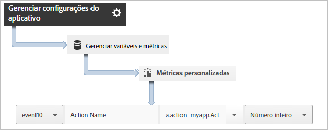

# Rastrear ações do aplicativo {#track-app-actions}

Ações são os eventos que ocorrem em seu aplicativo Android que você deseja medir.

Cada ação tem uma ou mais métricas correspondentes, que são incrementadas sempre que o evento ocorre. Por exemplo, você pode enviar uma chamada `trackAction` para cada assinatura nova sempre que um artigo é visualizado ou um nível é concluído. As ações não são rastreadas automaticamente, por isso, faça uma chamada `trackAction` quando ocorrer um evento que você deseja rastrear e mapeie a ação para um evento personalizado.

## Rastreamento de ações {#section_380DF56C4EE4432A823940E4AE4C9E91}

1. Adicione a biblioteca ao projeto e implemente o ciclo de vida.

   Para obter mais informações, consulte *Adicionar o SDK e o arquivo de configuração ao projeto IntelliJ IDEA ou Eclipse* na [Implementação principal e ciclo de vida](/help/android/getting-started/dev-qs.md).

1. Importe a biblioteca:

   ```java
   import com.adobe.mobile.*;
   ```

1. Quando a ação que deseja rastrear ocorrer em seu aplicativo, chame `trackAction` para enviar uma ocorrência para esta ação:

   ```java
   Analytics.trackAction("myapp.ActionName", null);
   ```

1. Na interface do usuário do Adobe Mobile Services, selecione seu aplicativo e clique em **[!UICONTROL Gerenciar configurações do aplicativo]**.
1. Clique em **[!UICONTROL Gerenciar variáveis e métricas]** e clique na guia **[!UICONTROL Métricas personalizadas]**.

1. Mapeie o nome do contexto de dados definido em seu código, por exemplo, `myapp.ActionName`, para um evento personalizado.

   

Você também pode configurar uma prop para manter todos os valores de ação, mapeando uma prop personalizada com um nome como **[!UICONTROL Ações personalizadas]** e definindo o valor para `a.action`.


## Envio de dados adicionais {#section_3EBE813E54A24F6FB669B2478B5661F9}

Além do nome da ação, você pode enviar dados de contexto adicionais com cada chamada de ação de rastreamento:

```java
HashMap<String, Object> exampleContextData = new HashMap<String, Object>(); 
exampleContextData.put("myapp.social.SocialSource", "Twitter"); 
Analytics.trackAction("myapp.SocialShare", exampleContextData);
```

Os valores de dados de contexto devem ser mapeados para variáveis personalizadas nos Adobe Mobile Services:


## Relatórios de ações {#section_0F6A54AB7A3F42C9BB042D86A0FC4630}

| Interface | Relatório |
|--- |--- |
| Adobe Mobile Services | Relatório dos **[!UICONTROL Caminhos de ação]**.  Veja a ordem em que as ações ocorrem em seu aplicativo. Você também pode clicar em **[!UICONTROL Personalizar]** em qualquer relatório para ver as ações classificadas, apresentadas em ordem de tendência ou em um relatório detalhado, ou aplicar um filtro para ver as ações de um segmento específico. |
| Relatórios e análises de marketing | Relatório de **[!UICONTROL Evento personalizado]**. Depois que uma ação é mapeada a um evento personalizado, é possível visualizar os eventos móveis semelhantes a todos os outros eventos do Analytics. |
| Ad hoc analytics | Relatório de **[!UICONTROL Evento personalizado]**. Depois que uma ação é mapeada a um evento personalizado, é possível visualizar os eventos móveis semelhantes a todos os outros eventos do Analytics. |

