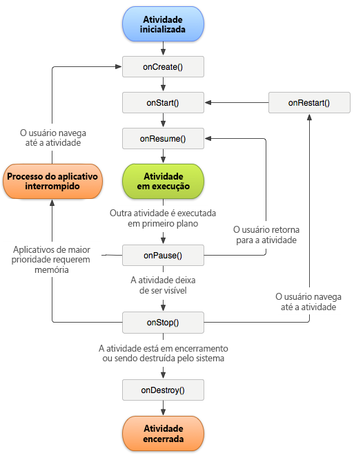

# Rastreamento de falhas do aplicativo {#track-app-crashes}

Essas informações ajudam a entender como as falhas são rastreadas e as práticas recomendadas para lidar com falsas falhas.

>[!TIP]
>
>As falhas do aplicativo são rastreadas como parte das medições de ciclo de vida. Antes de controlar falhas, adicione a biblioteca ao seu projeto e implemente o ciclo de vida. Para obter mais informações, consulte *Adicionar o SDK e o Arquivo de configuração ao projeto intellij IDEA ou Eclipse* na [implementação principal e ciclo de vida](/help/android/getting-started/dev-qs.md).

Quando as medições de ciclo de vida são implementadas, é feita uma chamada `Config.collectLifecycleData` no método `OnResume` para cada atividade. In the `onPause` method, a call is made to `Config.pauseCollectingLifeCycleData`.

Em `pauseCollectingLifeCycleData`, é definido um sinalizador pra indicar uma saída. Quando o aplicativo é inicializado novamente ou retomado, o `collectLifecycleData` seleciona esse sinalizador. Se o aplicativo não for bem sucedido ao sair, como determinado pelo status do sinalizador, um dado de contexto `a.CrashEvent` é enviado com a próxima chamada, e é reportado um evento de falha.

Para assegurar um relatório de falhas preciso, você deve chamar `pauseCollectingLifeCycleData` no método `onPause` de cada atividade. Para entender porque isso é essencial, esta é uma ilustração do ciclo de vida de uma atividade no Android:



Para obter mais informações sobre o ciclo de vida de uma atividade no Android, consulte [Atividades](https://developer.android.com/guide/components/activities.html).

*Esta ilustração do ciclo de vida do Android foi criada e[compartilhada pelo Projeto de fonte aberta do Android](https://source.android.com/)e usado de acordo com os termos na[Licença de atribuição dos Comuns criativos 2.5](https://creativecommons.org/licenses/by/2.5/).*

## O que pode causar o relato de falhas falsas?

1. Se estiver fazendo uma depuração com um IDE, como o Android Studio, iniciar o aplicativo novamente a partir do IDE enquanto o aplicativo está em primeiro plano causa uma falha.

   >[!TIP]
   >
   >Você pode evitar essa falha colocando o aplicativo em segundo plano antes de iniciar novamente pelo IDE.

1. If the last foreground Activity of your app is backgrounded and does not call `Config.pauseCollectingLifecycleData();` in `onPause`, and your app is manually closed or killed by the OS, the next launch results in a crash.

## Como gerenciar os Fragmentos?

Os Fragmentos possuem eventos de ciclo de vida semelhantes às Atividades. Contudo, um Fragmento não pode ser ativado sem que tenha sido anexado a uma Atividade.

>[!IMPORTANT]
>
>É necessário confiar nos eventos de ciclo de vida contra os quais as atividades contêineres podem executar seu código. Isso será tratado pela exibição principal do Fragmento.

## (Opcional) Implementar chamadas de retorno do ciclo de vida da atividade

A partir da API nível 14, o Android permite chamadas de retorno de ciclos de vida globais nas atividades. Para obter mais informações, consulte [Aplicativo](https://developer.android.com/reference/android/app/Application).

You can use these callbacks to ensure that all of your Activities correctly call `collectLifecycleData()` and `pauseCollectingLifecycleData()`. É necessário adicionar esse código apenas na Atividade principal e qualquer outra Atividade no site que pode ser iniciada pelo aplicativo:

```js
import com.adobe.mobile.Config; 
  
public class MainActivity extends Activity { 
... 
    @Override 
    protected void onCreate(Bundle savedInstanceState) { 
        super.onCreate(savedInstanceState); 
        setContentView(R.layout.activity_main); 
  
        getApplication().registerActivityLifecycleCallbacks(new Application.ActivityLifecycleCallbacks() { 
            @Override 
            public void onActivityResumed(Activity activity) { 
                Config.setContext(activity.getApplicationContext()); 
                Config.collectLifecycleData(activity); 
            } 
  
            @Override 
            public void onActivityPaused(Activity activity) {     
                Config.pauseCollectingLifecycleData(); 
            } 
    
            // the following methods aren't needed for our lifecycle purposes, but are required to be implemented 
            // by the ActivityLifecycleCallbacks object 
            @Override 
            public void onActivityCreated(Activity activity, Bundle savedInstanceState) {} 
            @Override 
            public void onActivityStarted(Activity activity) {} 
            @Override 
            public void onActivityStopped(Activity activity) {} 
            @Override 
            public void onActivitySaveInstanceState(Activity activity, Bundle outState) {} 
            @Override 
            public void onActivityDestroyed(Activity activity) {} 
        }); 
    } 
... 
}
```

To send additional context data with your lifecycle call by using `Config.collectLifecycleData(Activity activity`, `Map<String`, `Object> contextData)`, you must override the `onResume` method for that Activity and ensure that you call `super.onResume()` after manually calling `collectLifecycleData`.

```js
@Override 
protected void onResume() { 
    HashMap<String, Object> cdata = new HashMap<>(); 
    cdata.put("someKey", "someValue"); 
    Config.collectLifecycleData(this, cdata); 
  
    super.onResume(); 
}
```

