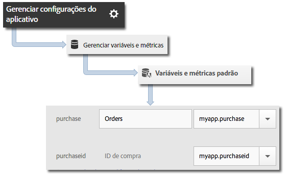

# Variável products {#products-variable}

A variável products não pode ser configurada usando as regras de processamento. No SDK móvel, é preciso usar uma sintaxe especial no parâmetro de dados de contexto para definir produtos na chamada do servidor.

Para configurar a variável *products*, defina uma chave de dados de contexto como `"&&products"` e defina o valor usando a sintaxe definida para a variável *products*:

```java
cdata.put("&&products", "Category;Product;Quantity;Price[,Category;Product;Quantity;Price]");
```

Por exemplo:

```java
//create a context data dictionary 
HashMap cdata = new HashMap<String, Object>(); 
 
// add products, a purchase id, a purchase context data key, and any other data you want to collect. 
// Note the special syntax for products 
cdata.put("&&products", ";Running Shoes;1;69.95,;Running Socks;10;29.99"); 
cdata.put("myapp.purchase", "1"); 
cdata.put("myapp.purchaseid", "1234567890"); 
 
// send the tracking call - use either a trackAction or TrackState call. 
// trackAction example: 
Analytics.trackAction("purchase", cdata); 
// trackState example: 
Analytics.trackState("Order Confirmation", cdata);
```

A variável *products* está definida na solicitação de imagem e as outras variáveis estão definidas como dados de contexto. Todas as variáveis de dados de contexto devem ser mapeadas usando as regras de processamento:



Não é necessário mapear a variável *products* usando as regras de processamento, pois essa variável é definida diretamente na solicitação de imagem pelo SDK.
