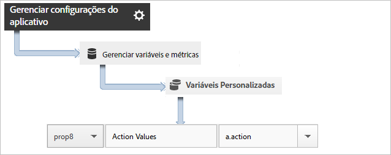
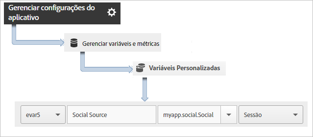

# Rastrear ações do aplicativo {#track-app-actions}

Ações são os eventos que ocorrem em seu aplicativo que você deseja medir. Cada ação tem uma ou mais métricas correspondentes, que são incrementadas sempre que o evento ocorre. Por exemplo, você pode rastrear uma nova assinatura cada vez que um artigo é visualizado ou cada vez que um nível é concluído. As métricas correspondentes para esses eventos são configuradas como assinaturas, artigos lidos e níveis concluídos.

As ações não são rastreadas automaticamente. Portanto para rastrear um evento é necessário chamar `trackAction`.

## Rastreamento de ações {#section_380DF56C4EE4432A823940E4AE4C9E91}

1. Adicione a biblioteca ao projeto e implemente o ciclo de vida.

   Para obter mais informações, consulte *Adicionar o SDK e o arquivo de configuração ao seu projeto* em [Implementação principal e ciclo de vida](/help/ios/getting-started/dev-qs.md).
1. Importe a biblioteca.

   ```objective-c
   #import "ADBMobile.h"
   ```

1. Quando a ação que deseja rastrear ocorrer em seu aplicativo, chame `trackAction` para enviar uma ocorrência para esta ação.

   ```objective-c
   [ADBMobile trackAction:@"myapp.ActionName"  
                     data:nil];
   ```

   >[!TIP]
   >
   >Se o código ao qual você está adicionando esta chamada puder ser executado enquanto o aplicativo está em segundo plano, chame `trackActionFromBackground` em vez de `trackAction`.

1. Na interface do usuário do Adobe Mobile Services, selecione seu aplicativo e clique em **[!UICONTROL Gerenciar configurações do aplicativo]**.

1. Clique em **[!UICONTROL Gerenciar variáveis e métricas]** e clique na guia **[!UICONTROL Métricas personalizadas]**.

1. Mapeie o nome do contexto de dados definido em seu código, por exemplo, `a.action=myapp.ActionName`, para um evento personalizado.

   

Você também pode configurar uma prop para manter todos os valores de ação, mapeando uma prop personalizada com um nome como **[!UICONTROL Ações personalizadas]** e definindo o valor para `a.action`.



## Envio de dados adicionais {#section_3EBE813E54A24F6FB669B2478B5661F9}

Além do nome da ação, você pode enviar dados de contexto adicionais com cada chamada de ação de rastreamento:

```objective-c
NSMutableDictionary *contextData = [NSMutableDictionary dictionary]; 
[contextData setObject:@"Twitter" forKey:@"myapp.social.SocialSource"]; 
[ADBMobile trackAction:@"myapp.SocialShare" data:contextData];
```

Os valores dos dados de contexto devem ser mapeados para variáveis personalizadas:



## Rastrear ações em segundo plano {#section_AC13013F207D4FBAAF27E4412034251E}

Se você estiver rastreando uma ação no código que pode ser executada quando o aplicativo estiver em segundo plano, chame `trackActionFromBackground` em vez de `trackAction`. Embora `trackActionFromBackground` contenha alguma lógica adicional para evitar que as chamadas de ciclo de vida disparem quando não deveriam, os parâmetros são os mesmos.

## Relatórios de ações {#section_0F6A54AB7A3F42C9BB042D86A0FC4630}

| Interface | Relatório |
|--- |--- |
| Adobe Mobile Services | Relatório dos **[!UICONTROL Caminhos de ação.]** Veja a ordem em que as ações ocorrem em seu aplicativo. Você também pode clicar em **[!UICONTROL Personalizar]** em qualquer relatório para ver as ações classificadas, apresentadas em ordem de tendência ou em um relatório detalhado, ou aplicar um filtro para ver as ações de um segmento específico. |
| Relatórios e análises de marketing | Relatório de **[!UICONTROL Evento personalizado]**. Depois que uma ação é mapeada a um evento personalizado, é possível visualizar os eventos móveis semelhantes a todos os outros eventos do Analytics. |
| Ad hoc analytics | Relatório de **[!UICONTROL Evento personalizado]**. Depois que uma ação é mapeada a um evento personalizado, é possível visualizar os eventos móveis semelhantes a todos os outros eventos do Analytics. |