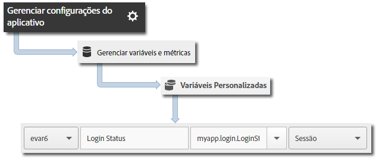

# Rastrear estados do aplicativo {#track-app-states}

Os estados são telas ou exibições diferentes no aplicativo. Cada vez que um novo estado é exibido em seu aplicativo, por exemplo, quando um usuário navega do home page para o feed de notícias, uma chamada de rastreamento de estado deve ser enviada. No iOS, um estado normalmente é rastreado no método viewDidLoad de cada visualização.

>[!TIP]
>
>Para rastrear estados, faça uma chamada para `trackState`. Os estados não são rastreados automaticamente.

## Rastreamento de estados {#section_380DF56C4EE4432A823940E4AE4C9E91}

1. Adicione a biblioteca ao projeto e implemente o ciclo de vida.

   Para obter mais informações, consulte *Adicionar o SDK e o arquivo de configuração ao seu projeto* em [Implementação principal e ciclo de vida](/help/ios/getting-started/dev-qs.md).
1. Importe a biblioteca.

   ```objective-c
   #import "ADBMobile.h"
   ```

1. Chame `trackState` para enviar uma ocorrência para esta exibição de estado.

   ```objective-c
   [ADBMobile trackState:@"Login Screen"  
                    data:nil];
   ```

Nos Adobe Mobile Services, o **[!UICONTROL State Name]** é relatado na variável *`View State`* e uma exibição será registrada para cada chamada `trackState`. Em outras interfaces do Analytics, o **[!UICONTROL Exibir estado]** é reportado como **[!UICONTROL Nome de página]** e as exibições de estado como exibições de páginas.

## Envio de dados adicionais {#section_CFDB4F944496401786A145C209AB387C}

Além do **[!UICONTROL Nome do estado]**, você pode enviar dados de contexto adicionais com cada chamada de ação de rastreamento:

```objective-c
NSMutableDictionary *contextData = [NSMutableDictionary dictionary]; 
[contextData setObject:@"logged in" forKey:@"myapp.login.LoginStatus"]; 
[ADBMobile trackState:@"Home Screen" data:contextData];
```

Os valores dos dados de contexto devem ser mapeados para variáveis personalizadas:



## Relatório do estado do aplicativo {#section_0F6A54AB7A3F42C9BB042D86A0FC4630}

Normalmente, os estados são visualizados usando um relatório de definição de caminho para que você possa ver como os usuários navegam no aplicativo e quais estados são mais visualizados.

|  |  |
|--- |--- |
| Adobe Mobile Services | O relatório **[!UICONTROL Exibir estados]**. Este relatório está baseado nos caminhos que o usuário tomou pelo aplicativo. A sample path is  **[!UICONTROL Home]**  >  **[!UICONTROL Settings]**  > **[!UICONTROL Feed]**. |
| Adobe Analytics | Os estados podem ser exibidos em qualquer lugar em que as Páginas podem ser exibidas, como o relatório **[!UICONTROL Páginas]**, o relatório **[!UICONTROL Exibições da página]** e relatórios de **[!UICONTROL Caminho]**. |
| Ad hoc analytics | Os estados podem ser exibidos em qualquer lugar em que as Páginas possam ser exibidas usando a dimensão **[!UICONTROL Página]**, a métrica **[!UICONTROL Exibições da página]** e os relatórios de **[!UICONTROL Caminho]**. |
