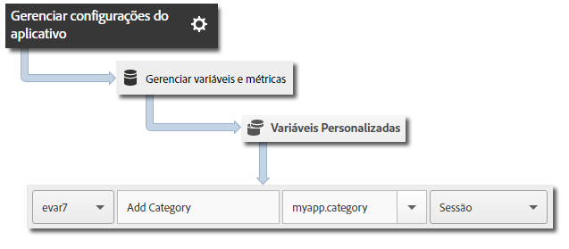

# Implementação principal e ciclo de vida {#core-implementation-and-lifecycle}

Esta informação ajuda a implementar a biblioteca do iOS e coletar medições de ciclo de vida, como inicializações, atualizações, sessões, usuários envolvidos e assim por diante.

## Baixar o SDK {#section_99FE1A17A36D4A2C943939023CF6265C}

>[!IMPORTANT]
>
>O SDK exige o iOS 8 ou mais recente.

**Pré-requisitos**

Antes de baixar o SDK, conclua as etapas em *Criar um conjunto de relatórios* na [Implementação principal e no ciclo de vida](/help/ios/getting-started/requirements.md) para configurar um conjunto de relatórios de desenvolvimento e baixar uma versão pré-preenchida do arquivo de configuração.

Para baixar o SDK:

>[!IMPORTANT]
>
>A partir da versão 4.21.0, o SDK é distribuído via XCFrameworks. Se estiver usando a versão 4.21.0 ou mais recente, siga as etapas abaixo.
>
>A versão 4.21.0 do SDK exige o Xcode 12.0 ou mais recente e, se aplicável, o Cocoapods 1.10.0 ou mais recente.

1. Baixe, descompacte o arquivo `[Your_App_Name_]AdobeMobileLibrary-4.*-iOS.zip` e verifique se você tem os seguintes componentes de software no diretório `AdobeMobileLibrary`:

   * `ADBMobile.h` - o arquivo de cabeçalho Objetive-C usado para o SDK do iOS.
   * `ADBMobileConfig.json` - o arquivo de configuração do SDK que é personalizado para seu aplicativo.
   * `AdobeMobile.xcframework` - contém dois binários multiarquiterura, um para dispositivos iOS (armv7, armv7s, arm64) e simuladores (i386, x86_64, arm64).

      Esse XCFramework deve ser vinculado ao direcionar um aplicativo iOS.

   * `AdobeMobileExtension.xcframework` - contém dois binários multiarquiterura, um para dispositivos iOS (armv7, armv7s, arm64) e simuladores (i386, x86_64, arm64).

      Esse XCFramework deve ser vinculado ao direcionar uma extensão do iOS.

   * `AdobeMobileWatch.xcframework` - contém dois binários multiarquitetura, um para dispositivos watchOS (arm64_32, armv7k) e simuladores (i386, x86_64, arm64).

      Esse XCFramework deve ser vinculado ao direcionar um aplicativo Apple Watch (watchOS).

   * `AdobeMobileTV.xcframework` - contém dois binários multiarquitetura, um para dispositivos tvOS (arm64) e simuladores (x86_64, arm64).

      Esse XCFramework deve ser vinculado ao direcionar um aplicativo da Apple TV (tvOS).

>[!IMPORTANT]
>
>Em versões anteriores à 4.21.0, o SDK é distribuído por meio de binários. Se estiver usando uma versão anterior à 4.21.0, siga as etapas abaixo.

1. Baixe, descompacte o arquivo `[Your_App_Name_]AdobeMobileLibrary-4.*-iOS.zip` e verifique se você tem os seguintes componentes de software:

   * `ADBMobile.h`, arquivo de cabeçalho em Objective-C usado no AppMeasurement do iOS.
   * `ADBMobileConfig.json`, que é o arquivo de configuração de SDK personalizado para o seu aplicativo.
   * `AdobeMobileLibrary.a`, um binário multiarquitetura habilitado para código de bits que contém os builds da biblioteca de dispositivos (armv7, armv7s, arm64) e dos simuladores (i386 e x86_64) do iOS.

      Esse binário deve ser vinculado quando o destino for pretendido para um aplicativo do iOS.

   * `AdobeMobileLibrary_Extension.a`, um binário multiarquitetura habilitado para código de bits que contém os builds da biblioteca de dispositivos (armv7, armv7s, arm64) e dos simuladores (i386 e x86_64) do iOS.

      Esse binário deve ser vinculado quando o destino for pretendido para uma extensão do iOS.

   * `AdobeMobileLibrary_Watch.a`, um binário multiarquitetura habilitado para código de bits que contém os builds da biblioteca dos dispositivos (armv7k) e dos simuladores (i386 e x86_64) do Apple Watch.

      Esse binário deve ser vinculado quando o destino for pretendido para um aplicativo de extensão do Apple Watch (watchOS 2).

   * `AdobeMobileLibrary_TV.a`, um binário multiarquitetura habilitado para código de bits que apresenta os builds da biblioteca dos novos dispositivos (arm64) e simuladores (x86_64) da Apple TV.

      Esse binário deve ser vinculado quando o destino for pretendido para um aplicativo da Apple TV (tvOS).

>[!IMPORTANT]
>
>Se você baixar o SDK fora da interface do Adobe Mobile Services, o arquivo `ADBMobileConfig.json` deverá ser configurado manualmente. Se você nunca usou o Analytics e o Mobile SDK, consulte [Antes de começar](/help/ios/getting-started/requirements.md) para configurar um conjunto de relatórios de desenvolvimento e baixar uma versão já preenchida do arquivo de configuração.

## Adicionar o SDK e o arquivo de configuração ao projeto {#section_93C25D893B4A4CD3B996CF3C5590C8DC}

1. Abra o Xcode IDE e o seu aplicativo.
1. No Navegador de projetos, arraste a pasta `AdobeMobileLibrary` e solte-a no seu projeto.
1. Verifique o seguinte:

   * A caixa de seleção **[!UICONTROL Copiar itens se necessário]** está marcada.
   * **[!UICONTROL Criar grupos]** está selecionado.
   * Nenhuma das caixas de seleção na seção **[!UICONTROL Adicionar aos destinos]** está marcada.

   

1. Clique em **[!UICONTROL Concluir]**.
1. No **[!UICONTROL Navegador de projetos]**, selecione **`ADBMobileConfig.json`**.
1. Em **[!UICONTROL Inspetor de arquivos]**, adicione o arquivo JSON a todos os destinos em seu projeto que usarão o SDK da Adobe.

   

1. No **[!UICONTROL Navegador de projetos]**, conclua as seguintes etapas:

   1. Clique no seu aplicativo.
   1. Na guia **[!UICONTROL Geral]**, selecione seus alvos e vincule as estruturas e bibliotecas necessárias nas seções **[!UICONTROL Estruturas vinculadas]** e **[!UICONTROL Bibliotecas]**.
   * **Destinos de aplicativos iOS**
      * `SystemConfiguration.framework`
      * `WebKit.framework`
      * `libsqlite3.0.tbd`
      * `AdobeMobileLibrary.a`
      * `CoreLocation.framework` (opcional, porém obrigatório para recursos de rastreamento geográfico)
   * **Destino de extensão do iOS**

      * `SystemConfiguration.framework`
      * `libsqlite3.0.tbd`
      * `AdobeMobileLibrary\_Extension.a`
   * **Destino Apple Watch (watchOS 2)**

      * `libsqlite3.0.tbd`
      * `AdobeMobileLibrary\_Watch.a`
   * **Destino da Apple TV (tvOS)**:

      * `SystemConfiguration.framework`
      * `libsqlite3.0.tbd`
      * `AdobeMobileLibrary\_TV.a`

   >[!CAUTION]
   >
   > Vincular mais de um arquivo `AdobeMobileLibrary*.a` ao mesmo destino resultará em um comportamento inesperado ou na incapacidade de criar o build.

   >[!IMPORTANT]
   >
   > Se estiver usando a versão 4.21.0 ou mais recente, verifique se o Adobe XCFrameworks não está incorporado.

   

1. Verifique se o aplicativo foi criado sem erros.

## Implementar medições de ciclo de vida {#section_532702562A7A43809407C9A2CBA80E1E}

>[!IMPORTANT]
>
>O iOS enviará informações de ciclo de vida fazendo ou não uma chamada com o `collectlifecycledata`, e o `collectlifecycledata` é só uma maneira de iniciar o ciclo de vida anteriormente na sequência de iniciação do aplicativo.

Após habilitar o ciclo de vida, cada vez que o aplicativo é iniciado uma ocorrência é enviada para medir as inicializações, atualizações, usuários engajados e outras [Medições de ciclo de vida](/help/ios/metrics.md).

Adicionar uma chamada `collectLifecycleData`/ `collectLifecycleDataWithAdditionalData` em `application:didFinishLaunchingWithOptions`:

```objective-c
- (BOOL)application:(UIApplication *)application didFinishLaunchingWithOptions:(NSDictionary *)launchOptions {
 [ADBMobile collectLifecycleData];
    return YES;
}
```

### Incluir dados adicionais com chamadas de ciclo de vida

Para incluir dados adicionais com chamadas de ciclo de vida, use `collectLifecycleDataWithAdditionalData`:

>[!IMPORTANT]
>
>Quaisquer dados transmitidos para o SDK por meio de `collectLifecycleDataWithAdditionalData:` serão mantidos em `NSUserDefaults` pelo SDK. O SDK desmonta os valores no parâmetro `NSDictionary` que não são dos tipos `NSString` ou `NSNumber`.

```objective-c
- (BOOL)application:(UIApplication *)application didFinishLaunchingWithOptions:(NSDictionary *)launchOptions {
    NSMutableDictionary *contextData = [NSMutableDictionary dictionary];
    [contextData setObject:@"Game" forKey:@"myapp.category"];
    [ADBMobile collectLifecycleDataWithAdditionalData:contextData];
    return YES;
}
```

Os valores dos dados de contexto adicionais enviados com o `collectLifecycleDataWithAdditionalData` devem ser mapeados para variáveis personalizadas no Adobe Mobile Services:



As outras medições de ciclo de vida são coletadas automaticamente. Para obter mais informações, consulte [Medições de ciclo de vida](/help/ios/metrics.md).

## O que fazer em seguida {#section_A24DC703359D4B5C8F493D6421306FD3}

Conclua as seguintes tarefas:

* [Rastrear estados do aplicativo](/help/ios/analytics-main/states.md)
* [Rastrear ações do aplicativo](/help/ios/analytics-main/actions.md)
