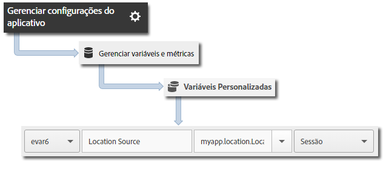

# Geolocalização e pontos de interesse {#geo-location-and-points-of-interest}

A localização geográfica auxilia na avaliação dos dados de localização usando latitude, longitude e pontos de interesse predefinidos em seus aplicativos iOS.

Cada chamada `trackLocation` envia o seguinte:

* Latitude, longitude e localização em um ponto de interesse (POI) que é definido nos Adobe Mobile Services.

   Essas informações são passadas para variáveis de solução móvel para relatórios automático.

* Distância do centro e precisão transmitidas como dados de contexto.

   Essas variáveis não são capturadas automaticamente. Você deve mapear essas variáveis de dados de contexto usando as instruções na seção *Envio de dados adicionais* abaixo.

## Atualização de POI dinâmico {#section_3747B310DD5147E2AAE915E762997712}

A partir da versão 4.2, os POIs são definidos na interface do Adobe Mobile e sincronizados dinamicamente no arquivo de configuração do aplicativo. Esta sincronização requer uma configuração `analytics.poi` no arquivo `ADBMobile.json`:

```js
"analytics.poi": "https://assets.adobedtm.com/…/yourfile.json",
```

Para obter mais informações, consulte [Configuração JSON do ADBMobile](/help/ios/configuration/json-config/json-config.md).

Se isso não for configurado, uma versão atualizada do arquivo `ADBMobile.json` deve ser baixada e adicionada ao aplicativo. Para obter mais informações e instruções, consulte *Download do SDK e Ferramentas de teste* em [Antes de iniciar](/help/ios/getting-started/requirements.md).

## Rastrear geolocalizações e POIs {#section_B1616E400A7548F9A672F97FEC75AE27}

1. Adicione a biblioteca ao projeto e implemente o ciclo de vida.

   Para obter mais informações, consulte *Adicionar o SDK e o arquivo de configuração ao seu projeto* em [Implementação principal e ciclo de vida](/help/ios/getting-started/dev-qs.md).
1. Importe a biblioteca:

   ```objective-c
   #import "ADBMobile.h"
   ```

1. Chame `trackLocation` para rastrear a localização atual:

   ```objective-c
   CLLocation *currentLocation = location; 
   [ADBMobile trackLocation: currentLocation data: nil]; 
   ```

   >[!TIP]
   >
   >Você pode chamar `trackLocation` a qualquer momento.

   Para determinar a localização passada para a chamada `trackLocation`, use [Obter a localização do usuário](https://developer.apple.com/Library/ios/documentation/UserExperience/Conceptual/LocationAwarenessPG/CoreLocation/CoreLocation.html).

Além disso, se for determinado que a localização está em um raio de POI definido, uma variável de dados de contexto `a.loc.poi` é enviada com a ocorrência `trackLocation` e é relatado como um POI nos relatórios de Localização. Uma variável de contexto `a.loc.dist` também é enviada com a distância em metros a partir das coordenadas definidas.

## Enviar dados adicionais {#section_3EBE813E54A24F6FB669B2478B5661F9}

Além dos dados de localização, você pode enviar dados de contexto adicionais com cada chamada de localização de rastreamento:

```objective-c
NSMutableDictionary *contextData = [NSMutableDictionary dictionary]; 
[contextData setObject:@"GPS" forKey:@"myapp.location.LocationSource"]; 
[ADBMobile trackLocation: currentLocation data:contextData];
```

Os valores dos dados de contexto devem ser mapeados para variáveis personalizadas:



## Dados do contexto de localização {#section_FFB71E6653F9410A89CC6ACC0C9164A9}

A latitude e a longitude são enviadas usando três parâmetros de dados de contexto diferentes, com cada parâmetro representando um nível diferente de precisão, para um total de seis parâmetros de dados de contexto.

Por exemplo, as coordenadas lat = 40.93231, lon = -111.93152 representam um local com precisão de 1 m. Esse local é dividido de acordo com o nível de precisão nas seguintes variáveis:

* `a.loc.lat.a`= 040.9
* `a.loc.lat.b` = 32
* `a.loc.lat.c` = 31
* `a.loc.lon.a` = -111,9
* `a.loc.lon.b` = 31
* `a.loc.lon.c` = 52

Alguns níveis de precisão podem aparecer como &quot;00&quot;, dependendo da precisão da localização atual. Por exemplo, se a localização tiver uma precisão de 100 m, `a.loc.lat.c` e `a.loc.lon.c` serão preenchidos com &quot;00&quot;.

## Informações adicionais {#section_931AC1E0D88147E29FE1B6E3CC1E9550}

Lembre-se das seguintes informações:

* Uma solicitação `trackLocation` envia o equivalente a uma chamada `trackAction`.

* Os POIs não são transmitidos como parte das chamadas `trackAction` e `trackState` normais; portanto, você deve usar uma chamada `trackLocation` para rastrear POIs.

* A `trackLocation` deve ser chamada sempre que necessário para rastrear a localização e os POIs.

   Recomendamos chamar `trackLocation` quando o aplicativo for iniciado e conforme necessário com base nos requisitos do aplicativo.

* Os POIs são preenchidos somente após serem definidos no arquivo de configuração do aplicativo.

   Eles não são aplicados às chamadas históricas `trackLocation` que foram enviadas anteriormente.
* As chamadas `trackLocation` permitem o envio de dados de contexto adicionais como as chamadas `trackAction`.

* Quando dois POIs possuem diâmetros sobrepostos, é usado o primeiro POI que contém a localização atual.

   Se seus POIs se sobrepõem, você deve listar os POIs na ordem do mais granular para o menos granular para garantir que o POI mais granular seja relatado.
