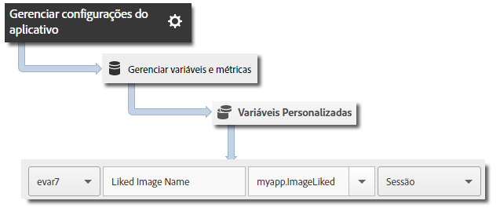

# Rastreamento iBeacon {#ibeacon-tracking}

O rastreamento do iBeacon permite medir e segmentar micro locais usando iBeacon e Low Energy Bluetooth.

Os seguintes dados de beacon são enviados para o Analytics e o Target quando `trackBeacon` é chamado:

* `a.beacon.uuid` - ProximityUUID do beacon
* `a.beacon.major` - Número principal do beacon, como o número da loja
* `a.beacon.minor` - Número menor do beacon, como um número exclusivo em uma loja
* `a.beacon.prox` - Os seguintes valores representam a proximidade do usuário com o beacon:

   * `0` é desconhecido
   * `1` é imediato
   * `2` é perto
   * `3` é longe

## Rastrear iBeacons {#section_FC3F213545944A468B1E6D5D5C8E2F1F}

1. Adicione a biblioteca ao projeto e implemente o ciclo de vida.

   Para obter mais informações, consulte *Adicionar o SDK e o arquivo de configuração ao seu projeto* em [Implementação principal e ciclo de vida](/help/ios/getting-started/dev-qs.md).
1. Importe a biblioteca:

   ```objective-c
   #import "ADBMobile.h"
   ```

1. Quando um dispositivo estiver na proximidade de um beacon, chame `trackBeacon`:

   ```objective-c
   [ADBMobile trackBeacon:beacon data:nil];
   ```

1. Quando o usuário deixar a proximidade do beacon, limpe o beacon atual:

   ```objective-c
   [ADBMobile trackingClearCurrentBeacon];
   ```

## Enviar dados adicionais {#section_3EBE813E54A24F6FB669B2478B5661F9}

Além do nome da ação cronometrada, você pode enviar dados de contexto adicionais com cada chamada de ação de rastreamento:

```objective-c
[ADBMobile trackBeacon:beacon data:@{@"myapp.ImageLiked" : imageName}];
```

Os valores dos dados de contexto devem ser mapeados para variáveis personalizadas:



## Exemplos {#section_9749238BCBC148998CB18E97D7670D19}

```objective-c
- (void)locationManager:(CLLocationManager *)manager didRangeBeacons:(NSArray *)beacons inRegion:(CLBeaconRegion *)region { 
    if (beacons.count > 0) { 
        CLBeacon *beacon = beacons[0]; 
        // Adobe - track when in range of a beacon 
        [ADBMobile trackBeacon:beacon data:@{@"sampleContextData" : @"sampleContextDataVal"}]; 
    } 
} 
 
// When the user leaves the proximity of the beacon, clear the current beacon 
[ADBMobile trackingClearCurrentBeacon];
```
