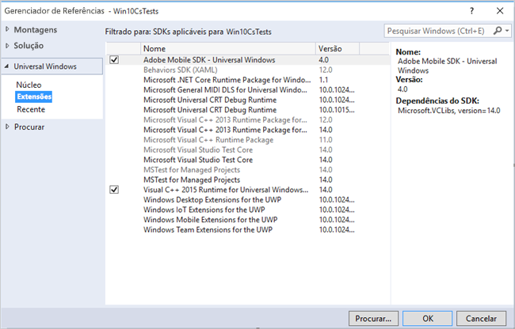

# Windows Visual Studio extensions for Experience Cloud Solutions 4.x SDK {#windows-visual-studio-extensions-for-experience-cloud-solutions-x-sdk}

Esta extensão fornece uma maneira muito mais fácil de adicionar a referência do Experience Cloud Solutions 4.x SDK do Windows no seu projeto.

## Instalar a biblioteca do GitHub {#section_F55DB6241EF1475286C05FEAEBF996A3}

1. Baixe o Windows Universal SDK do [GitHub](https://github.com/Adobe-Marketing-Cloud/mobile-services/releases).
1. Descompacte o arquivo baixado localmente.
1. Clique com o duplo no arquivo **[!UICONTROL ADBMobileUniversalWindowsVSIX.vsix]** para abrir o instalador.
1. Selecione Localização **** global e instale a biblioteca.

## Adicionar referências ao seu projeto {#section_00C14FE9243D4330BE1F4BB56FCF08B1}

1. Abra o projeto do Windows 10.
1. Abra a caixa de diálogo Gerenciador de referência.

   

1. Na guia **[!UICONTROL Extensões]** , localize e selecione **[!UICONTROL Adobe Mobile SDK]**.
1. Click **[!UICONTROL OK]** to save it.

   O SDK do Adobe Mobile será adicionado ao seu projeto. Se o pacote **[!UICONTROL Microsoft Visual C++ Runtime]** ainda não tiver sido adicionado, este pacote também será adicionado ao seu projeto.

1. No Configuration Manager, selecione um tipo de plataforma e comece a testar seu aplicativo.

