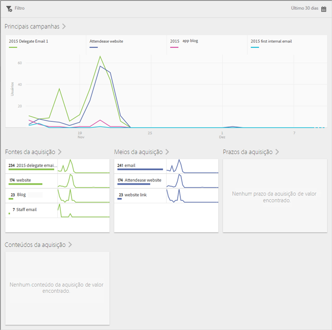
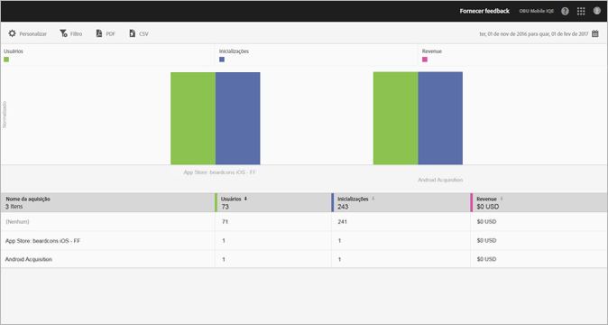

# Aquisição {#acquisition}

Os profissionais de marketing podem criar links de rastreamento para promover e direcionar o tráfego para seus aplicativos. Esses links de rastreamento podem direcionar usuários para app stores, deep links de aplicativos e intersticiais, que podem ser correlacionados ao comportamento no aplicativo. Um profissional de marketing pode criar um único link para direcionar usuários para iOS, Android ou outras plataformas, conforme necessário.

## Nova versão do SDK da Adobe Experience Cloud

Procurando informações e documentação relacionadas ao Adobe Experience Platform Mobile SDK? Clique [aqui](https://aep-sdks.gitbook.io/docs/) para acessar a documentação mais recente.

Em setembro de 2018, lançamos uma nova versão principal do SDK. Esses novos Adobe Experience Platform Mobile SDKs podem ser configurados por meio do [Experience Platform Launch](https://www.adobe.com/br/experience-platform/launch.html).

* Para começar, acesse o [Launch](https://launch.adobe.com/).
* Para ver o conteúdo dos repositórios SDK da Experience Platform, acesse [Github: SDKs da Adobe Experience Platform](https://github.com/Adobe-Marketing-Cloud/acp-sdks).

>[!IMPORTANT]
>
> Se você estiver usando os SDKs para dispositivos móveis da Adobe Experience Platform com o Adobe Launch, também **deve** instalar a extensão Adobe Analytics Mobile Services para usar os recursos do Adobe Mobile Services, como os Links de aquisição. Para obter mais informações, consulte [Adobe Analytics - Mobile Services](https://aep-sdks.gitbook.io/docs/using-mobile-extensions/adobe-analytics-mobile-services). Para obter mais informações sobre como usar os Links de aquisição e marketing com os SDKs da Experience Cloud, consulte [Links de aquisição e marketing](https://aep-sdks.gitbook.io/docs/using-mobile-extensions/adobe-analytics-mobile-services#acquisition-and-marketing-links).

>[!IMPORTANT]
>
>Embora seja possível configurar recursos na interface do usuário, eles não funcionarão até você baixar o arquivo de configuração gerado e adicioná-lo ao SDK. Para obter informações sobre como baixar e configurar os SDKs, consulte a seção *Documentação do SDK* nesta página.)

Você pode criar, editar, gerenciar e exibir relatórios em links de marketing rastreáveis de aplicativos móveis.

>[!TIP]
>
>Essa funcionalidade exige o Adobe Analytics Mobile Apps ou o Adobe Analytics Premium SKU.

Os seguintes Relatórios de aquisição oferecem insights sobre o desempenho dos seus Links de marketing:

* **Visão geral** {#section_5B2BA47F22694919A472AB591101237E}

   Este relatório exibe as principais campanhas que levaram os usuários ao seu aplicativo com informações sobre o desempenho das campanhas em outros metadados de rastreamento, como fonte de aquisição, meio, prazo e conteúdo.

   

* **Relatório de links** {#section_A23A640C363B43569D9D484CF49EA277}

   Esse relatório inclui uma exibição classificada do desempenho dos Links de marketing. Além de ver os nomes dos links com as métricas principais de desempenho, também é possível personalizar o relatório. Para obter mais informações, consulte [Personalizar relatórios](/help/using/usage/reports-customize/t-reports-customize.md).

   Lembre-se das seguintes informações:

   * Você pode clicar nos ícones de seta nos cabeçalhos das colunas para classificar os dados em ordem crescente ou decrescente.
   * Para exportar os dados para um documento PDF, você pode clicar em **[!UICONTROL Download]**.
   
