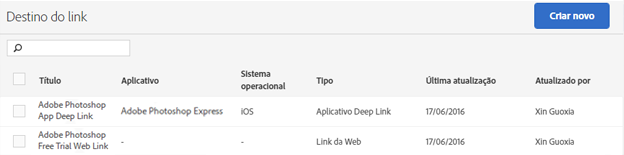

# Criar e gerenciar destinos de links {#create-and-manage-link-destinations}

Na página Gerenciar destinos do link, é possível criar, editar, arquivar/desarquivar e excluir destinos de links. Esses destinos podem ser embutidos na criação de links de marketing, notificações por push ou mensagens no aplicativo.

Para exibir a página Gerenciar destinos do link:

1. No menu de navegação esquerdo, clique em **[!UICONTROL Gerenciar aplicativos]**.
1. Clique no nome do aplicativo para exibir a página Informações do aplicativo.
1. No canto superior direito, clique em **[!UICONTROL Gerenciar destinos do link]**.

A página Destinos do link exibe os destinos do link e dá opções para criar, arquivar, desarquivar, editar e excluir os destinos do link.

Por exemplo:

