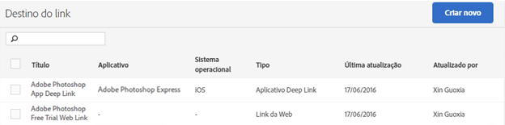

# Gerenciar destinos de links {#manage-link-destinations}

Você pode usar a página Destinos do link para editar, arquivar, desarquivar ou excluir o destino existente.

Para exibir a página Gerenciar destinos do link:

1. Na interface do Mobile Services, clique em **[!UICONTROL Gerenciar aplicativos]**.
1. Na página Informações do aplicativo do seu aplicativo, clique em **[!UICONTROL Gerenciar destinos de links]**.

   

1. (Condicional) Conclua as tarefas apropriadas:

   * **Editar**

      Para editar um destino de link existente, clique em seu nome na lista e edite os campos relevantes. Para obter mais informações, consulte [Criar um novo destino de link](/help/using/acquisition-main/c-manage-link-destinations/t-create-new-app-deep-link-destination.md).

      >[!IMPORTANT]
      >
      >Essas alterações podem levar até 15 minutos para entrarem em vigor.

   * **Arquivar**

      Você pode arquivar os destinos de links que deseja manter, mas remover da lista de **[!UICONTROL Destinos de links]**.

      Para arquivar destinos de links existentes, marque uma ou mais caixas de seleção ao lado dos nomes dos links e clique em **[!UICONTROL Arquivar selecionados]**. Como o destino de link está arquivado e pode ser desarquivado a qualquer momento, não é necessário confirmar sua ação.

   * **Desarquivar**

      Você pode desarquivar os destinos de links arquivados anteriormente que deseja exibir novamente na lista Destinos de links.

      Para desarquivar um destino de link:

      1. clique em **[!UICONTROL Exibir arquivo]**.
      1. Marque uma ou mais caixas de seleção ao lado dos nomes dos links que você deseja desarquivar.
      1. Clique em **[!UICONTROL Desarquivar selecionados]**.

      A opção **[!UICONTROL Arquivo de exibições]** somente é exibido se você arquivou destinos de links anteriormente.

   * **Excluir**

      Para excluir um destino de link, marque uma ou mais caixas de seleção ao lado dos itens que deseja excluir, clique em **[!UICONTROL Excluir selecionados]**, e em **[!UICONTROL Excluir]** para confirmar a ação.

      >[!IMPORTANT]
      >
      >A exclusão de um destino de link é **permanente**. Se você não tem certeza se deseja excluir um destino de link, use a opção de arquivamento.

