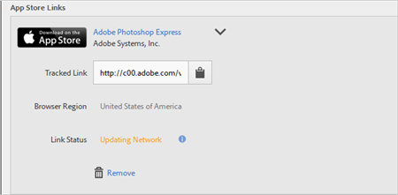

# Criação de um link de aquisição {#create-an-acquisition-link}

Crie links da loja de aplicativos que permitem baixar os aplicativos diretamente da Apple App Store e do Google Play. Os links criados permitem que você atribua eventos de sucesso aos downloads.

1. Clique em **[!UICONTROL Aquisição]** > **[!UICONTROL Gerenciar links de aquisição]** > **[!UICONTROL Criar novo]**.
1. Digite as seguintes informações nos campos na seção **[!UICONTROL Informações do link]**:

   * (**Obrigatório**) **[!UICONTROL Nome]**
Especifique um nome descritivo para o link do aplicativo.
   * **[!UICONTROL Código de rastreamento]**
Especifique o código de rastreamento desejado ou clique em **[!UICONTROL Gerar]** para criar um novo código.
   * (**Obrigatório**) **[!UICONTROL Fonte]**
Especifique o referenciador original, como “boletim informativo” ou “página inicial”.
   * **[!UICONTROL Meio]**
Especifique o meio de marketing, por exemplo, “banner” ou “email”.
   * **[!UICONTROL Conteúdo]**
Especifique o nome ou a ID do anúncio com o link.
   * **[!UICONTROL Termo]**
Especifique os termos de pagamento ou outros termos de pesquisa para o anúncio.
   >[!IMPORTANT]
   >
   >Não é possível alterar os valores nos campos acima após a criação do link de aquisição.

1. Digite as informações nos campos na seção **[!UICONTROL Adicionar link da loja de aplicativos]**.

   * **[!UICONTROL Loja de aplicativos]**

      Selecione uma loja de aplicativos:
      * Apple App Store
      * Google Play

      As opções para cada loja de aplicativos variam, conforme descrito abaixo.

   * **[!UICONTROL Região do navegador (somente para a Apple App Store)]**

      Especifique uma App Store regional específica para navegadores de desktop.

      Esta configuração permite definir o link de aquisição que direcionará para a app store de uma região específica quando um usuário clicar no link de um navegador para desktop. Os dispositivos remotos são redirecionados automaticamente de acordo com as configurações do dispositivo.

   * **[!UICONTROL Idioma do navegador (Idioma do Google (somente Google Play))]**

      Selecione um idioma na lista suspensa.

      Essa configuração permite definir um idioma específico para exibir no Google Play Store para navegadores desktop. Os dispositivos remotos exibem o idioma de acordo com as configurações do dispositivo.

   * **[!UICONTROL Pesquisar por nome]**

      * Na Apple App Store, se você não souber a ID do aplicativo, poderá pesquisá-lo pelo nome.

         É possível restringir sua pesquisa selecionando uma região opcional na lista suspensa **[!UICONTROL Na região]**.

      * No Google Play, se você não souber o Nome do pacote, poderá pesquisar pelo nome do aplicativo.
   * **[!UICONTROL ID do aplicativo (somente na Apple App Store)]**

      Se tiver pesquisado o aplicativo, esse campo será preenchido automaticamente. Você pode digitar o valor ID do aplicativo diretamente, em vez de pesquisar pelo aplicativo.

   * **[!UICONTROL Nome do pacote (somente no Google Play)]**

      Se tiver pesquisado o aplicativo, esse campo será preenchido automaticamente. Em vez de pesquisar, você também pode digitar diretamente o valor Nome do pacote.

1. Para salvar sua configuração e gerar o link, clique em **[!UICONTROL Adicionar]** > **[!UICONTROL Salvar]**.

   O link criado recentemente é exibido na seção **[!UICONTROL Links da loja de aplicativos]**.

   

1. Clique em  para copiar o link rastreado para a área de transferência.

1. Cole o link em suas postagens nas mídias sociais, anúncios, mensagens de email e assim por diante.
