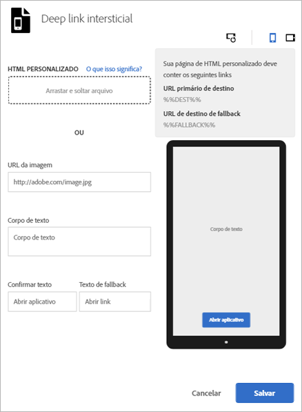

# Intersticiais{#interstitials}

É possível direcionar os usuários para um destino. Depende se eles têm o aplicativo instalado (um deep link de aplicativo) ou não (para um site ou uma app store). É melhor deixar a escolha do roteamento para os usuários. Os profissionais de marketing podem fornecer opções de usuário configurando uma página intersticial que mostra aos usuários os destinos de aterrissagem disponíveis.

Para configurar um intersticial ao   criar um Link de marketing:

1. Clique em **[!UICONTROL Editar link profundo intersticial]**.

   

1. Digite informações nos seguintes campos:

   * **[!UICONTROL HTML personalizado]**

      Selecione sua página HTML intersticial personalizada.

      Ao usar intersticiais personalizados, os profissionais de marketing podem personalizar páginas de aterrissagem intersticiais com HTML/CSS/JS personalizados, o que permite que você atribua uma marca às suas páginas.

      Estes são os requisitos para a página HTML:

      * Deve ser um arquivo HTML.
      * Deve conter os espaços reservados `%%DEST%%` e `%%FALLBACK%%`.
      * O HTML carregado será tratado em um `<iframe>`.

         Você deve garantir que os destinos dos links apontem para uma janela principal. Você pode incluir `<base target="_parent" />` no `<head>` ou especificar uma propriedade-alvo para cada `<a/>` individualmente.

         >[!TIP]
         >
         >Se você fizer upload de um HTML personalizado, as outras quatro opções nessa tabela não serão usadas, a menos que você remova o arquivo enviado.
   * **[!UICONTROL URL da imagem]**

      Especifique o URL para um ativo de imagem.

   * **[!UICONTROL Corpo de texto]**

      Especifique o texto do corpo para o intersticial.

   * **[!UICONTROL Texto de confirmação]**

      Especifique o texto para o botão de texto.

   * **[!UICONTROL Texto de fallback]**

      Especifique o texto de fallback que será exibido.

      Esse campo atualiza o botão de texto se ocorrer uma falha em um deep link. Os usuários são direcionados para experimentar o deep link para que possam voltar para outra opção. Por exemplo, um fallback pode servir para uma loja de aplicativos baixar e instalar o aplicativo ou levar os usuários para o site da empresa. O texto de fallback permite que os usuários saibam que há outra opção disponível se ocorrer uma falha no link direto.

1. (**Opcional**) Clique nos ícones acima da imagem para ver como o intersticial aparece rotacionado e em dispositivos diferentes.

   Você pode alterar ou editar a imagem fora do Mobile Services para garantir que a imagem seja exibida corretamente em diferentes situações.
1. Clique em **[!UICONTROL Salvar]**.
