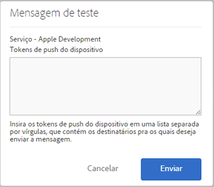

# Pré-requisitos para habilitar as mensagens por push {#prerequisites-to-enable-push-messaging}

Você deve concluir essas tarefas antes de configurar as mensagens por push nos seus aplicativos.

## Habilitar a Experience Cloud para sua empresa

Sua empresa do Adobe Analytics deve ter a Experience Cloud habilitada. Você pode verificar o status com seu Executivo de contas da Adobe.

## Instalar e configurar o SDK móvel

* **Instalar o SDK do Mobile**

   Para configurar as mensagens por push, você deve baixar e instalar a versão 4.6 ou posterior do SDK Móvel. Para obter mais informações, consulte [Baixar os SDKs](/help/using/c-manage-app-settings/c-mob-confg-app/t-config-analytics/download-sdk.md).

* **Configurar serviços de push**

   Você deve configurar serviços de push no SDK do Mobile.
Para obter mais informações, consulte o seguinte conteúdo:

   * [Mensagens por push no Android](/help/android/messaging-main/push-messaging/push-messaging.md)
   * [Mensagens por push no iOS](/help/ios/messaging-main/push-messaging/push-messaging.md)

## Logon nos serviços principais do Mobile usando sua Adobe ID

>[!IMPORTANT]
>
>Para usar a funcionalidade Serviços de push, os usuários devem fazer logon no Mobile Core Service usando a Adobe ID. Além disso, a conta do Analytics desses usuários deve estar vinculada à sua Adobe ID. A funcionalidade Serviços de push não estará disponível se os usuários fizerem logon usando suas contas existentes do Adobe Analytics.

Se os usuários não tiverem Adobe IDs, siga estas etapas:

1. (**Administrador da Experiencie Cloud**) Convidar usuários para a Experience Cloud.

1. (**Usuário**) Criar uma Adobe ID pessoal seguindo as instruções enviadas pelo administrador da Experience Cloud.

   Quando o administrador concluir a etapa anterior, todos os usuários receberão automaticamente uma mensagem por email.

1. (**Usuários**) Fazer logon no Mobile usando a Adobe ID.

## Vincular contas de usuários na Experience Cloud

Cada usuário deve vincular a conta da solução do Analytics a partir da organização da Experience Cloud.

1. Faça logon no [Adobe Experience Cloud](https://experience.adobe.com) com uma Adobe ID.

1. No canto superior direito, selecione o nome da empresa do Analytics.

1. Clique em **[!UICONTROL Adicionar organização]** e selecione **[!UICONTROL Adobe SiteCatalyst/Adobe Social]** na lista suspensa.

1. Digite o nome da empresa, suas credenciais herdadas para a empresa especificada e clique em **[!UICONTROL Vincular conta]**.

   A Adobe ID agora está vinculada às suas credenciais de conta, empresa e logon do Analytics.

Para obter mais informações, consulte [Organizações no Experience Cloud](https://experienceleague.adobe.com/docs/core-services/interface/administration/organizations.html?lang=pt-BR) no guia Componentes da interface central do Experience Cloud.

## Configurar serviços de push e o serviço de ID do SDK na interface do usuário do Mobile

Antes de habilitar o Serviço de ID para o aplicativo, a seção **[!UICONTROL Serviços de push]** é desabilitada. Mas, depois de habilitar o serviço de ID, a seção Serviços de push é habilitada. Para obter mais informações sobre como ativar serviços de push, consulte [Configurar opções do serviço de ID do SDK](/help/using/c-manage-app-settings/c-mob-confg-app/t-config-visitor.md).

>[!IMPORTANT]
>
>Você deve clicar em **[!UICONTROL Salvar]** para salvar as alterações e atualizar os Serviços de push.
>
>Você pode configurar um aplicativo da app store para a Apple e um para o Google em cada conjunto de relatórios. Se você precisar de aplicativos adicionais, por exemplo, um para um ambiente de produção e outro para um ambiente dev, configure um novo aplicativo da app store e um novo conjunto de relatórios para cada ambiente.

* Para a **Apple**, arraste e solte sua chave privada e/ou certificado. Se a chave privada estiver criptografada por senha, digite a senha.

   * Para a **Chave privada**, arraste e solte seu arquivo de chave privada na caixa.

      Você também pode clicar em **[!UICONTROL Navegar]** para selecionar o arquivo. Esse arquivo possui a chave privada. O certificado também pode estar incluído nesse arquivo (`.p12`, `pkcs12`, `.pfx`, `.key`, `.pem`).

   * Para a **Senha da chave privada**, se o arquivo da chave privada estiver criptografado, digite a senha.

      (Condicional) Para o **Certificado**, arraste e solte o arquivo do certificado na caixa. Você também pode clicar em **[!UICONTROL Navegar]** para selecionar o arquivo. Esse campo não é necessário se o arquivo da chave privada também contiver o certificado ( `.cert`, `.cer`, `.crt`, `.pem`).

* Para o **Google**, especifique a chave de API do aplicativo.

   Clique em **[!UICONTROL Testar]** para validar se o aplicativo e o Mobile Services estão configurados corretamente. Essa opção é útil para a depuração e solução de problemas.

   Digite os tokens de push do dispositivo que você deseja enviar a mensagem. Você pode enviar a mensagem para vários dispositivos especificando tokens em uma lista separada por vírgula.

   
