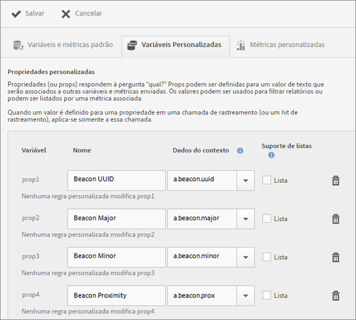
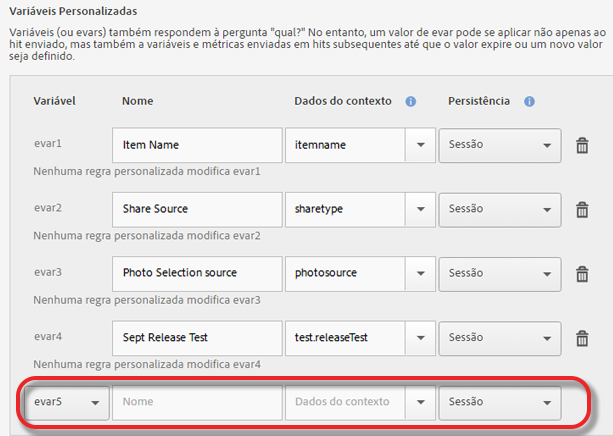

# Gerenciamento do aplicativo {#managing-your-app}

{#eol}

Você pode acompanhar e gerenciar os dados recebidos do aplicativo ao configurar diversas variáveis e métricas.

## Gerenciar variáveis e métricas   {#section_EC2D58AC334F4ED49E764B81C2423A62}

* **Variáveis e métricas padrão**

   Cada aplicativo inclui variáveis e métricas para rastrear atividades de compra e carrinho de compras. Algumas informações de compra não podem ser tratadas com regras de processamento; portanto, o SDK expõe os dados de contexto `"&&products"` especiais. Por exemplo, você pode ter variáveis como adições ao carrinho, remoções do carrinho, check-outs, pedidos e assim por diante. Os dados de contexto devem ser mapeados para dados no Adobe Analytics. Se essa variável for preenchida como um mapeamento simples dos dados de contexto, essa é a chave que realiza o mapeamento. Deixe em branco se a variável estiver preenchida por regras mais complexas nas Ferramentas administrativas do Analytics.

* **Variáveis personalizadas**

   A página Variáveis personalizadas exibe todas as variáveis personalizadas do Analytics que são configuradas para o conjunto de relatórios com os dados do aplicativo. Nessa página, você pode habilitar mais variáveis e mapear dados de contexto diretamente nas variáveis do Analytics.

### Mapeamento de dados de contexto a variáveis do Analytics

Clique em **[!UICONTROL Gerenciar configurações do aplicativo]** > **[!UICONTROL Gerenciar variáveis e métricas]** > **[!UICONTROL Variáveis personalizadas]**.

Esses mapeamentos chamam a mesma API que [Regras de processamento](https://experienceleague.adobe.com/docs/analytics/admin/admin-tools/processing-rules/processing-rules.html) usar no Adobe Analytics.

Esta é uma lista das variáveis personalizadas que você pode configurar:

* As **[!UICONTROL Propriedades personalizadas]** (ou props) respondem à pergunta “qual?” As props podem ser definidas com um valor de texto que será associado a outras variáveis e métricas enviadas na mesma ocorrência. Os valores podem ser usados para filtrar relatórios ou podem ser listados em ordem de classificação por uma métrica associada.

   Quando um valor é definido para uma propriedade em uma chamada de rastreamento (ou ocorrência), ele se aplica somente a essa chamada.

* O **[!UICONTROL Variáveis personalizadas]** (ou eVars) também responde à pergunta &quot;qual?&quot; No entanto, um valor de eVar pode ser aplicado não apenas à ocorrência para a qual foi enviado, mas também às variáveis e métricas enviadas em ocorrências subsequentes até o valor expirar ou um novo valor ser definido.
* As **[!UICONTROL Variáveis personalizadas de lista (ou Variáveis de múltiplos valores)]** se comportam da mesma forma que as variáveis, exceto que permitem capturar vários valores em uma única ocorrência. Para obter mais informações, consulte [lista](https://experienceleague.adobe.com/docs/analytics/implementation/vars/page-vars/list.html?lang=pt-BR) na documentação do Adobe Analytics.

A informação de que esses mapeamentos foram criados no Mobile Services é exibida no Analytics.

* **[!UICONTROL Nome]**

   O nome amigável para a variável de coleção de dados.

* **[!UICONTROL Dados de contexto]**

   Se essa variável for preenchida como um mapeamento simples dos dados de contexto, essa é a chave que realiza o mapeamento. Deixe esse campo em branco caso a variável esteja preenchida por regras mais complexas nas Ferramentas de administrador do Analytics.

   Clique na coluna de dados de contexto e selecione a variável de dados de contexto que você deseja mapear. A lista suspensa contém variáveis recebidas nos últimos 30 dias, portanto, se os dados de contexto que você deseja mapear não estiverem na lista, digite-os.

* **[!UICONTROL Persistência (Variáveis personalizadas e Variáveis personalizadas de lista)]**

   A persistência determina o ponto em que o valor de uma Variável personalizada (eVar) expirará ou não será mais associado a ocorrências adicionais. Se uma eVar tiver expirado ao disparar uma ocorrência, o valor Nenhum será associado à ocorrência para essa eVar. Isso significa que nenhum valor de eVar estava ativo quando a ocorrência foi acionada.

   Você pode selecionar uma das seguintes opções:

   * **[!UICONTROL Session]**

      O valor da eVar persiste durante a visita do Analytics.

   * **[!UICONTROL Chamada de rastreamento]**

      O valor da eVar persiste somente para a chamada de rastreamento ou ocorrência na qual foi incluído.

   * **[!UICONTROL Nunca expira]**

      O valor da eVar persiste para todas as chamadas de rastreamento subsequentes.
   * **[!UICONTROL Avançado]**

      O Adobe Analytics possui uma interface do usuário mais avançada para configurar a persistência de eVars. Se for definido para a eVar um valor de persistência que não é suportado no Mobile Services, esse valor será mostrado na interface do usuário do Mobile Services.

      Para gerenciar eVars, clique em **[!UICONTROL Gerenciador do conjunto de relatórios do Adobe Analytics]** > **[!UICONTROL Interface de usuário de variáveis de conversão]**.

   * **[!UICONTROL Suporte de listas]**

      Permite que diversos valores sejam associados a propriedades em uma chamada de rastreamento. O delimitador deve ter um único caractere e não pode ser zero ou um espaço.

   * **[!UICONTROL Delimitador]**

      O delimitador deve ter um único caractere e não pode ser zero ou um espaço.

### Variáveis adicionais do Analytics

Você pode ativar variáveis adicionais usando a lista suspensa na parte inferior de cada seção de variável.

Selecione um número de variável não utilizado e digite um nome. Como opção, você pode fornecer a variável de dados de contexto que deseja armazenar e quaisquer informações adicionais.

* **Métricas personalizadas**

    Métricas (ou eventos) respondem à pergunta *quanto?* ou *quantos?*. Os eventos podem aumentar sempre que o usuário fizer uma ação ou reter valores numéricos, como um preço. As métricas personalizadas incluem eventos como a criação de um aplicativo, o download ou exportação do arquivo PDF ou CSV, a gravação de uma campanha, o download do SDK, a execução de um relatório, a adição de um link à loja de aplicativos, a ativação de uma mensagem no aplicativo e assim por diante.

   Selecione um dos seguintes tipos de métricas personalizadas:

   * **[!UICONTROL Número inteiro]**
   * **[!UICONTROL Número decimal]**
   * **[!UICONTROL Moeda]**

## Gerenciar pontos de interesse {#section_990EF15E4E3B42CC807FCD9BEC8DB4C6}

Pontos de interesse permitem definir localizações geográficas que você pode usar para fins de correlação, para segmentar com mensagens no aplicativo e muito mais. Quando uma ocorrência é enviada em um ponto de interesse, ele é anexado à ocorrência. Para obter mais informações sobre pontos de interesse, consulte   [Gerenciar pontos de interesse](/help/using/location/t-manage-points.md).

## Gerenciar destinos de links {#section_F722A387E22A430187B063D358A87711}

Você pode criar, editar, arquivar/desarquivar e excluir destinos de links. Esses destinos podem ser chamados embutidos na criação de links de marketing, notificações por push ou mensagens no aplicativo. Para obter mais informações sobre destinos de links, consulte [Gerenciar destinos de links](/help/using/acquisition-main/c-manage-link-destinations/t-archive-unarchive-link-destinations.md).

## Gerenciar postbacks {#section_78B0A8D7AE6940E78D85AE3AB829E860}

Os postbacks permitem enviar dados coletados pelo Adobe Mobile para um servidor de terceiros separado. Ao usar os mesmos acionadores e características que você usa para exibir uma mensagem no aplicativo, você pode configurar os Mobile para enviar dados personalizados a um destino de terceiros. Para obter mais informações sobre postbacks, consulte   [Configuração de postbacks](/help/using/c-manage-app-settings/c-mob-confg-app/signals.md).
