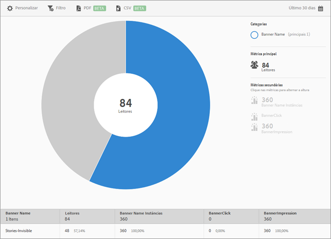

# Métricas de banner {#banner-metrics}

O relatório **[!UICONTROL Métricas de banner]** exibe uma visualização em forma de raio de sol dos dados existentes. Este relatório está disponível somente para clientes do Digital Publishing Suite (DPS).

Por padrão, esse relatório exibe as seguintes métricas:

* **[!UICONTROL Nome do banner]**, que é a identificação do banner.
* **[!UICONTROL Leitores]**, que é o número de usuários do aplicativo.
* **[!UICONTROL Instâncias de nome do banner]**, que é o número de vezes que o banner foi referenciado por meio de cliques e impressões.
* **[!UICONTROL Cliques no banner]**, que é o número de vezes que os usuários clicaram no banner.
* **[!UICONTROL Impressões do banner]**, que é o número de vezes que um banner foi visualizado (ou estava visível) em uma página do navegador.

Esse relatório é semelhante ao relatório de **[!UICONTROL Tecnologia]**. Para obter mais informações sobre como navegar e usar os gráficos de explosão solar, adicionar detalhamentos e métricas, criar atividades do Target, criar filtros fixos e compartilhar relatórios, consulte [Tecnologia](/help/using/usage/reports-technology.md). A informação neste tópico pode ser usada para personalizar o relatório **[!UICONTROL Métricas de banner]**.
