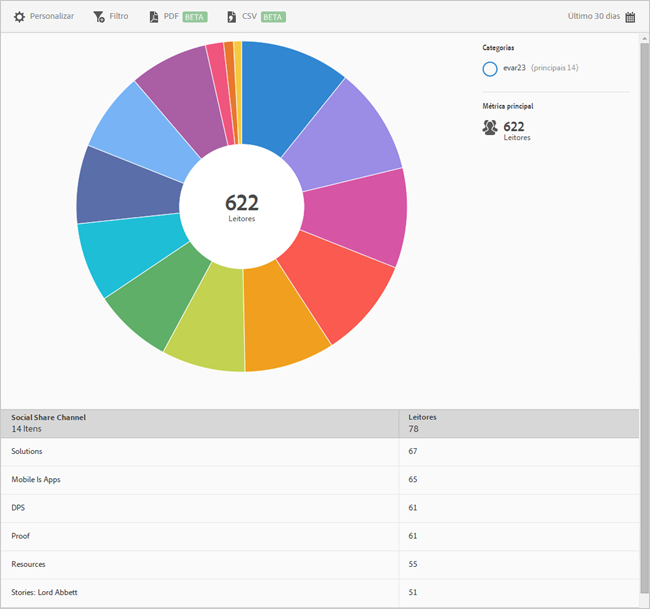

# Compartilhamento em redes sociais{#social-sharing}

O relatório **[!UICONTROL Compartilhamento em redes sociais]exibe uma visualização em forma de raio de sol dos dados existentes.** Este relatório está disponível somente para clientes do DPS.

Por padrão, este relatório mostra o número de leitores que compartilharam artigos em diferentes canais, como email, mensagem e assim por diante.

Esse relatório é semelhante ao relatório de **[!UICONTROL Tecnologia].** For information about how to navigate and use sunburst reports; add breakdowns and metrics; create target activities; create sticky filters, and share reports, see [Technology](//help/using/usage/reports-technology.md). As informações no tópico Tecnologia podem ser usadas para personalizar o relatório **[!UICONTROL Compartilhamento em redes sociais].**
