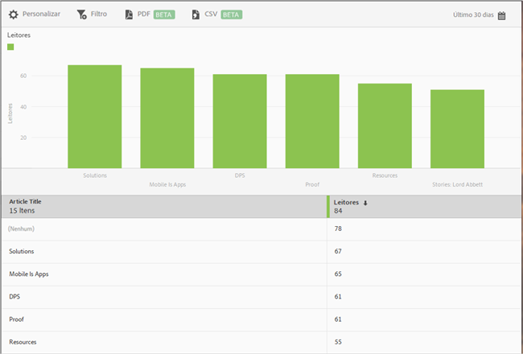

# Relatório Os 50 artigos principais {#top-articles}

O relatório **[!UICONTROL Os 50 artigos principais]** exibe um gráfico de barras e um relatório classificado, mostrando no aplicativo os artigos mais lidos. Esse relatório está disponível somente para clientes do DPS.

Embora o relatório padrão exiba dados dos últimos 30 dias sobre o número de leitores, é possível personalizar o relatório.

Por padrão, esse relatório mostra o título do artigo e o número de leitores.

Você pode configurar as seguintes opções no relatório:

* **[!UICONTROL Período]**
Clique no ícone **[!UICONTROL Calendário]** para selecionar um período personalizado ou um período atual na lista suspensa.

* **[!UICONTROL Personalizar]**

   Personalize seus relatórios alterando as opções **[!UICONTROL Mostrar por]**, adicionando métricas e filtros e adicionando séries (métricas) e muito mais. Para obter mais informações, consulte [Personalizar relatórios](/help/using/usage/reports-customize/reports-customize.md).

* **[!UICONTROL Filtro]**

   Clique em **[!UICONTROL Filtro]** para criar um filtro que abrange vários relatórios e observar o desempenho de um segmento específico em todos os relatórios móveis. Um filtro fixo permite definir um filtro aplicado a todos os relatórios não relacionados à definição de caminho. Para obter mais informações, consulte [Adicionar um filtro fixo](/help/using/usage/reports-customize/t-sticky-filter.md).

* **[!UICONTROL Baixar]**

   Clique em **[!UICONTROL PDF]** ou **[!UICONTROL CSV]** para baixar ou abrir documentos e compartilhá-los com usuários que não têm acesso ao Mobile Services ou para usá-los em apresentações.