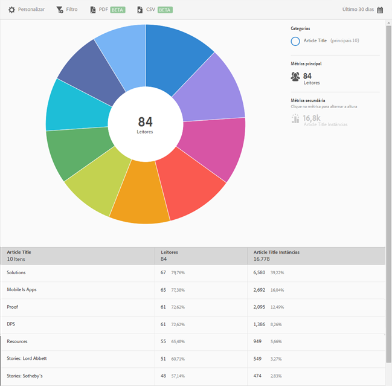

# Relatório dos 10 artigos principais{#top-articles}

O relatório **[!UICONTROL Os 10 artigos principais]** exibe um gráfico de explosão solar de acordo com seus dados. Esse relatório está disponível somente para clientes do DPS.

Por padrão, esse relatório mostra o título do artigo, o número de leitores e a porcentagem do total de leitores, além das ocorrências e da porcentagem do título do artigo.

Esse relatório é semelhante ao relatório de **[!UICONTROL Tecnologia]**. Para obter mais informações sobre como navegar e usar os gráficos de explosão solar, adicionar detalhamentos e métricas, criar atividades do Target, criar filtros fixos e compartilhar relatórios, consulte [Tecnologia](/help/using/usage/reports-technology.md). Essas informações podem ser usadas para personalizar o relatório **[!UICONTROL Os 10 artigos principais]**.
