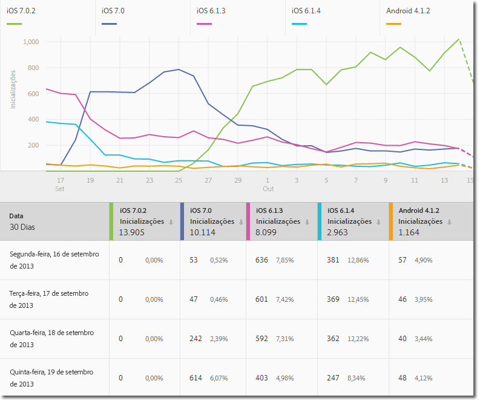
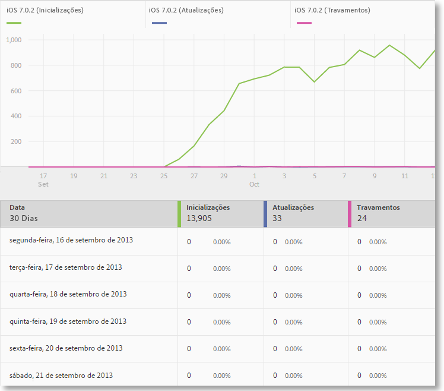
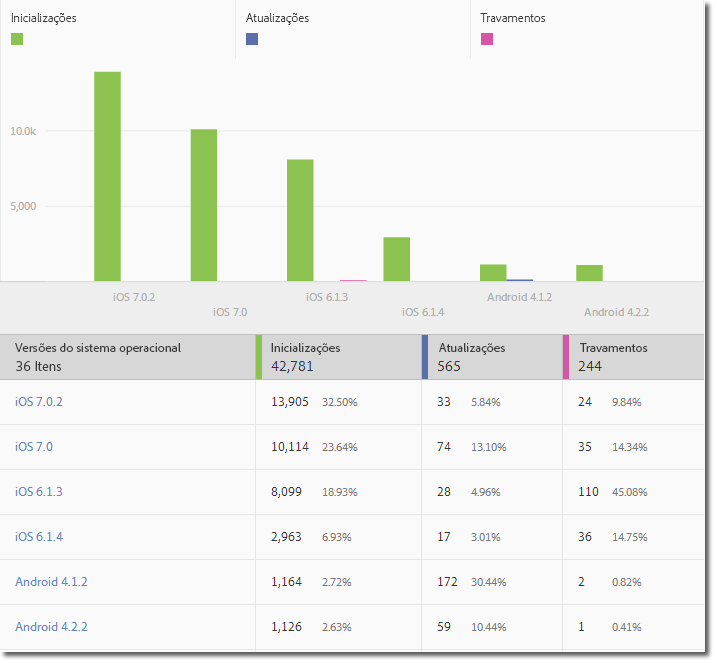
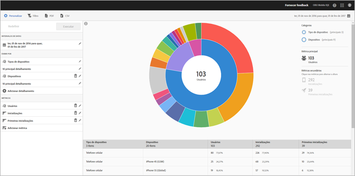
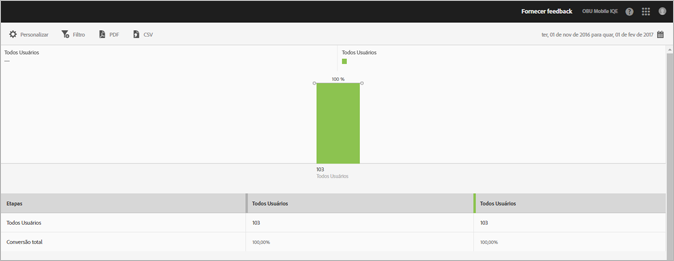

# Tipos de relatórios {#report-types}

Ao personalizar relatórios, é possível que a ampla flexibilidade faça com que surjam algumas dúvidas em relação ao tipo de relatório que é mais adequado para obter os dados de que você necessita.

Antes de personalizar os relatórios, você deve entender a diferença entre uma métrica e uma dimensão.

* Métrica

   Uma métrica é usada para medir seus dados. As métricas são valores que podem ser contados e adicionados e são usadas para ver a frequência com que ações específicas ocorrem no aplicativo. Métricas comuns incluem instalações, inicializações, rendimento, valor de duração e logons. Por exemplo, cada vez que o seu aplicativo é inicializado, o valor das _ launches_ value aumenta em um.

* Dimensão

   Uma dimensão é usada para descrever seus dados. As dimensões são representadas usando uma sequência de caracteres ou um número que atue como uma sequência de caracteres (como um código postal, e é usado para organizar e segmentar seus dados. Exemplos de dimensões comuns incluem a versão do sistema operacional, o nome da campanha, o nome do produto e a operadora de celular. Cada dimensão tem uma série de valores específicos que estão associadas a essa dimensão. For example, the OS version dimension has values such as _iOS 7_ and _Android 4.1.2_.

Estes são os tipos de relatórios que você pode gerar na interface do usuário móvel:

## Relatório ao longo do tempo {#section_2741DA54C90C49AFB17C7B9BC7AD627D}

Relatórios ao longo do tempo mostram o desempenho das métricas durante um certo período de tempo para que você possa identificar rapidamente crescimentos e tendências. A análise geralmente começa em um relatório ao longo do tempo e passa para relatórios de tendências e classificações, conforme você detalha para investigar os fatores que podem estar contribuindo para um pico ou tendência de métrica.

Por exemplo, se perceber um crescimento nas inicializações, será possível executar um relatório de tendências que exibirá as inicializações dos 5 principais sistemas operacionais para ver quais sistemas estão contribuindo mais para este crescimento:

Para exibir valores de dimensão com outras métricas em um relatório ao longo do tempo, você pode usar a métrica de instâncias e definir um filtro de dimensão.

## Relatório de tendências {#section_C9BE9A2EDBFF4D938B9AF14C8AA67883}

Os relatórios de tendência ajudam você a ver o desempenho de suas dimensões mais populares em relação a uma métrica. Você pode usar esse relatório para determinar quais valores estão contribuindo mais para uma alteração em uma métrica.

Para exibir um relatório de tendência para uma dimensão, adicione um filtro fixo (por exemplo, Sistema operacional = iOS 6.0.1) a um relatório ao longo do tempo para ver os mesmos dados. Como um bônus, você pode adicionar mais cinco métricas ao relatório ao longo do tempo filtrado.

## Relatório ao longo do tempo filtrado {#section_F8FAF2A4496F449CA99EF1E052C71A2D}

Se você tiver um valor de dimensão específico que deseja visualizar, poderá adicionar um filtro fixo a um relatório ao longo do tempo. O relatório a seguir mostra as inicializações, atualizações e travamentos de uma versão específica de um sistema operacional ao longo de 30 dias.

## Relatório classificado {#section_C073D744A95843AF99EE74FB5B013735}

Os relatórios classificados mostram a frequência com que as 50 principais dimensões contribuem para uma métrica. Esse relatório é útil para visualizar a contribuição total para uma gama de dados dentro de uma série de valores.

## Relatório em forma de raio de sol {#section_17A9842039174DE094A6B1E9837E35BB}

Os relatórios em forma de raio de sol fornecem, por exemplo, o relatório base junto com os detalhamentos. A visualização usa a altura para mostrar a métrica e as diferenças de desempenho entre as métricas. Cada círculo concêntrico representa um segmento de público-alvo na categoria desse círculo. É possível realizar ações com um público-alvo, como aplicar um filtro fixo, ocultar uma métrica e visualizar métricas.

Você pode visualizar o relatório de um tutorial no produto que explica como interagir com um gráfico em forma de raio de sol.

Para iniciar o tutorial:

1. em Gerenciar configurações do aplicativo, clique em **[!UICONTROL Utilização]**.

1. Click **[!UICONTROL Technology]** &gt; **[!UICONTROL Technology Breakdown]**.
1. In the title bar of the report, click **[!UICONTROL Customize]**, and click the information icon.

### Relatório de definição de caminho {#section_AD400106BC684B50B27CCCD3F4497114}

Um relatório de definição de Caminhos se baseia na análise de caminhos e mostra um gráfico que representa os caminhos que foram tomados de um estado para outro no aplicativo.

Cada nó tem a forma de uma caixa e representa um estado nos caminhos dos usuários em um aplicativo. Por exemplo, na ilustração acima, o nó superior representa o número de usuários que inicializaram o aplicativo e escolheram uma foto da galeria.

### Relatório de funil {#section_AF3B0C899D844FC3AD1F91A2C452C92F}

Os relatórios de funil permitem identificar onde os clientes abandonam uma campanha de marketing ou foram desviados de um caminho de conversão definido ao interagirem com o aplicativo móvel. Você também pode usar o relatório Funil para comparar ações de segmentos diferentes.

A visualização em funil permite observar onde os clientes saem do processo. Obter visibilidade sobre as decisões do cliente em cada etapa permite compreender onde são dissuadidos, que caminho costumam seguir e quando saem do aplicativo.

