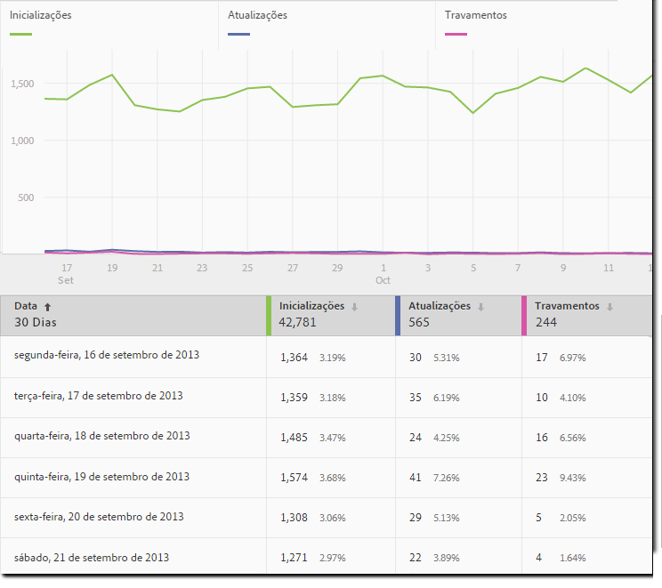
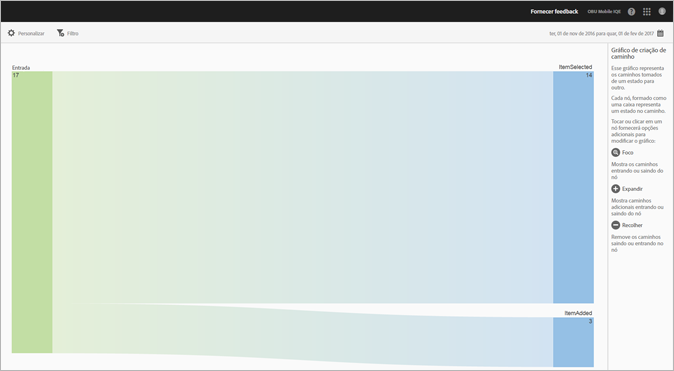

# Tipos de relatórios {#report-types}

Ao personalizar relatórios, é possível que a ampla flexibilidade faça com que surjam algumas dúvidas em relação ao tipo de relatório que é mais adequado para obter os dados de que você necessita.

Antes de personalizar relatórios, é necessário entender a diferença entre uma métrica e uma dimensão.

* Métrica

   Uma métrica é usada para medir seus dados. Métricas são valores que podem ser contados e adicionados e são usadas para ver com que frequência ações específicas ocorrem no aplicativo. Métricas comuns incluem instalações, inicializações, rendimento, valor de duração e logons. Por exemplo, cada vez que o seu aplicativo é inicializado,   o   _launches_value aumenta uma unidade.

* Dimensão

   Uma dimensão é usada para descrever seus dados. As dimensões são representadas usando uma sequência de caracteres ou um número que atue como uma sequência de caracteres (por exemplo, um código postal) e são usadas para organizar e segmentar seus dados. Exemplos de dimensões comuns incluem versão do SO, nome da campanha, nome do produto e operadora de celular. Cada dimensão tem vários valores específicos associados a ela. Por exemplo, a dimensão da versão de sistema operacional possui valores como _iOS 7_ e _Android 4.1.2_.

Estes são os tipos de relatórios que você pode gerar na interface do usuário móvel:

## Relatório ao longo do tempo {#section_2741DA54C90C49AFB17C7B9BC7AD627D}

Relatórios ao longo do tempo mostram o desempenho das métricas em um intervalo de tempo para que você possa identificar rapidamente picos e tendências. A análise geralmente tem início em um relatório ao longo do tempo e passa para relatórios classificados e de tendências à medida que você detalha para investigar os fatores que podem estar contribuindo para um pico ou tendência de métrica.

Por exemplo, se você vir um pico nas inicializações, poderá executar um relatório de tendências que mostra as inicializações dos 5 principais sistemas operacionais para ver quais sistemas estão contribuindo mais para o pico nas inicializações:

Para visualizar valores de dimensão com outras métricas em um relatório ao longo do tempo, você pode usar a métrica de instâncias e definir um filtro de dimensão.

## Relatório de tendências   {#section_C9BE9A2EDBFF4D938B9AF14C8AA67883}

Os relatórios de tendências ajudam você a visualizar o desempenho das dimensões mais populares em relação a uma métrica. Você pode usar esse relatório para determinar quais valores estão contribuindo mais para uma alteração em uma métrica.

Para visualizar um relatório de tendências para uma dimensão, adicione um filtro fixo (por exemplo, Sistema operacional = iOS 6.0.1) a um relatório ao longo do tempo para visualizar os mesmos dados. Como bônus, você pode adicionar cinco métricas ao relatório ao longo do tempo filtrado.

## Relatório ao longo do tempo filtrado {#section_F8FAF2A4496F449CA99EF1E052C71A2D}

Se você tiver um valor de dimensão específico que deseja visualizar, poderá adicionar um filtro fixo a um relatório ao longo do tempo. O relatório a seguir mostra 30 dias de inicializações, atualizações e falhas para uma versão específica do sistema operacional.

## Relatório classificado {#section_C073D744A95843AF99EE74FB5B013735}

Relatórios classificados mostram a frequência com que as 50 principais dimensões contribuem para uma métrica. Este relatório é útil para visualizar a contribuição total para um intervalo de datas em um grande número de valores.

## Gráfico de explosão solar    {#section_17A9842039174DE094A6B1E9837E35BB}

Os relatórios em forma de raio de sol fornecem, por exemplo, o relatório base junto com os detalhamentos. A visualização usa a altura para mostrar a métrica e as diferenças de desempenho entre as métricas. Cada círculo concêntrico representa um segmento público alvo na categoria desse círculo. É possível realizar ações em um público alvo, como aplicar um filtro fixo, ocultar uma métrica e visualizar métricas.

Você pode visualizar o relatório em um tutorial no produto que descreve como interagir com um gráfico em forma de raio de sol.

Para iniciar o tutorial:

1. em Gerenciar configurações do aplicativo, clique em **[!UICONTROL Utilização]**.

1. Clique em **[!UICONTROL Tecnologia]** > **[!UICONTROL Detalhamento da tecnologia]**.
1. Na barra de título do relatório, clique em **[!UICONTROL Personalizar]**, e clique no ícone de informações.

### Relatório de definição de caminho {#section_AD400106BC684B50B27CCCD3F4497114}

Um relatório de Definição de caminho é baseado na análise de caminho e exibe um gráfico de definição de caminho que representa caminhos que são tomados de um estado no aplicativo para outro estado.

Cada nó, formado como uma caixa, representa um estado nos caminhos dos usuários em um aplicativo. Por exemplo, na ilustração acima, o nó superior representa o número de usuários que inicializaram o aplicativo e selecionaram uma foto na galeria.

### Relatório de funil    {#section_AF3B0C899D844FC3AD1F91A2C452C92F}

Os relatórios de funil permitem identificar onde os clientes abandonam uma campanha de marketing ou se desviam de um caminho de conversão definido ao interagirem com seu aplicativo móvel. Você também pode usar o relatório Funil para comparar as ações de segmentos diferentes.

A visualização de funil permite ver onde os clientes abandonam o processo. Obter visibilidade sobre as decisões do cliente em cada etapa permite compreender onde eles são dissuadidos, que caminho costumam seguir e quando saem do aplicativo.

