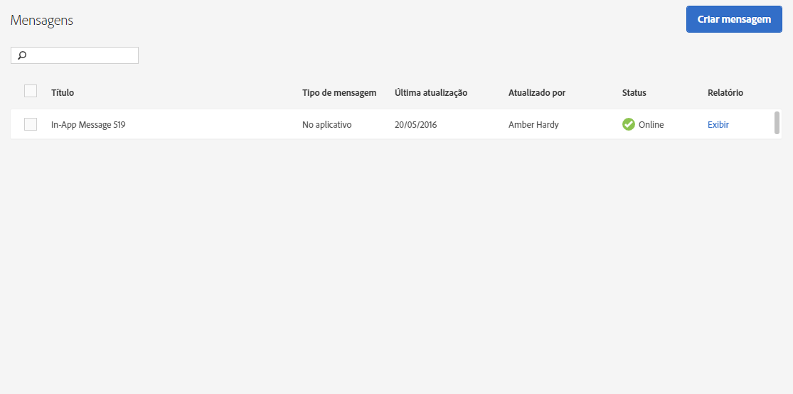

# Gerenciamento de mensagens{#manage-messages}

Exiba uma lista de mensagens no aplicativo e de push com detalhes sobre quando cada mensagem foi atualizada pela última vez e se as mensagens estão ao vivo ou foram desativadas.

Você pode duplicar, ativar/desativar e arquivar/desarquivar mensagens. Também é possível exibir um relatório que mostra o número de usuários que visualizaram a mensagem e os que clicaram nela.

Para gerenciar mensagens, clique em ***seu_ app_ name*** &gt; **[!UICONTROL Mensagens]** &gt; **[!UICONTROL Gerenciar mensagens]**.

Veja informações adicionais sobre as tarefas que você pode concluir nas mensagens:

* **Pesquisar e filtrar mensagens**

   Use a caixa de pesquisa na parte superior da lista para pesquisar e filtrar mensagens. Tudo o que for digitado na caixa de pesquisa exibirá as mensagens correspondentes na lista. A pesquisa funciona em todas as colunas da tabela. Por exemplo, você pode digitar `Draft` para exibir apenas mensagens com esse status. Também é possível digitar o nome de um usuário para exibir apenas as mensagens atualizadas por esse usuário.

   Além da caixa de pesquisa, você também pode clicar em qualquer cabeçalho da coluna para classificar a lista em ordem crescente ou decrescente pelo conteúdo dessa coluna.

   Por exemplo, se você classificar a coluna **[!UICONTROL Tipo de mensagem]em ordem crescente, todas as mensagens no aplicativo serão exibidas antes das mensagens de push.** Se você classificar a coluna **[!UICONTROL Última atualização]em ordem decrescente, a lista exibirá as mensagens atualizadas mais recentes no topo da lista.**

* **Duplicação de mensagens**

   1. Marque a caixa de seleção ao lado de uma ou mais mensagens e clique em **[!UICONTROL Duplicar seleção]**.
   1. Selecione o aplicativo em que deseja criar uma mensagem duplicada.
   1. Digite um nome para a mensagem.

      Para duplicar uma mensagem para o mesmo aplicativo, digite um novo nome para a mensagem. Se você mantiver o mesmo nome para substituir a mensagem original. Se estiver duplicando uma mensagem para outro aplicativo, mantenha o mesmo nome sem substituir a mensagem original.

   1. Click **[!UICONTROL Duplicate]** or **[!UICONTROL Overwrite]**, as necessary.

* **Desativação ou ativação de mensagens**

   Para desativar uma mensagem, marque a caixa de seleção ao lado de pelo menos uma mensagem ativa e clique em **[!UICONTROL Desativar seleção]**.

   Para ativar uma mensagem desativada, marque a caixa de seleção ao lado de, pelo menos, uma mensagem desativada e clique em **[!UICONTROL Ativar seleção]**.

* **Arquivamento de mensagens**

   Para arquivar mensagens e limpar a lista de mensagens:

   >[!TIP]
   >
   >Antes de arquivar uma mensagem, você deve desativá-la.

   1. Marque a caixa de seleção ao lado de, pelo menos, uma mensagem desativada e clique em **[!UICONTROL Arquivar seleção]**.

* **Visualização de mensagens arquivadas**

   1. Clique em **[!UICONTROL Exibir arquivo]**.
   1. Marque a caixa de seleção ao lado de pelo menos uma mensagem arquivada e clique em **[!UICONTROL Desarquivar seleção]**.

