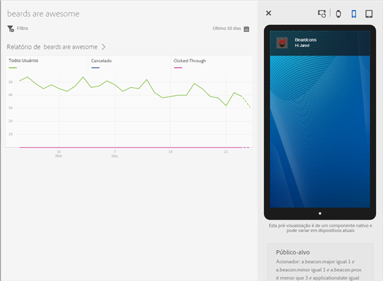
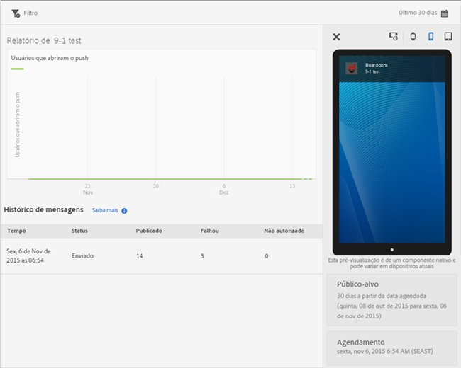

# Visualizar relatórios de mensagem {#view-message-reports}

Você pode exibir relatórios de mensagens para mensagens no aplicativo e de push.

1. Clique em  na coluna **[!UICONTROL Relatório]** de uma mensagem.
1. (**Opcional**) Crie um filtro fixo para o relatório ou altere o período de tempo clicando no ícone **[!UICONTROL Calendário]**.

   Para obter mais informações sobre como criar um filtro fixo, consulte [Adicionar um filtro fixo](/help/using/usage/reports-customize/t-sticky-filter.md).

>[!TIP]
>
>Dependendo do tipo de mensagem que você está visualizando, o relatório pode variar.

## Mensagens no aplicativo {#section_90B79BA58E8141F78538C187EB1BF8C7}

Se você estiver visualizando os relatórios de uma mensagem no aplicativo, eles serão semelhantes à seguinte ilustração:

### Métricas de mensagem no aplicativo

Esta é uma lista das métricas que estão disponíveis para mensagens no aplicativo:

* **[!UICONTROL Impressão]**, quando uma mensagem é acionada.

* **[!UICONTROL Click-Through]**, quando um usuário pressiona o botão **[!UICONTROL Click-Through]** em uma mensagem de alerta ou em tela cheia, e quando um usuário abre o aplicativo a partir de uma notificação local.

* **[!UICONTROL Cancelar]**, quando um usuário pressiona o botão **[!UICONTROL Cancelar]** em uma mensagem de alerta ou em tela cheia.

* **[!UICONTROL Taxa de engajamento]**, uma métrica calculada do Adobe Analytics, resultado do número de click-throughs dividido pelo número de impressões.

## mensagens por push {#section_BEAFD858CA194185B6F88903446058E9}

Se você estiver visualizando os relatórios de uma mensagem de push, eles serão semelhantes à seguinte ilustração:

O gráfico na parte superior exibe o número de usuários que abriram a mensagem.

### Métricas de mensagens por push

Esta é uma lista das métricas disponíveis para mensagens por push:

* **[!UICONTROL Hora]**

   A hora em que a mensagem foi encaminhada para dispositivos do Mobile Services.

* **[!UICONTROL Status]**

   O status da mensagem e os status disponíveis são:

   * **[!UICONTROL Cancelado]**
   * **[!UICONTROL Programado]**
   * **[!UICONTROL Em execução]**
   * **[!UICONTROL Executado]**

* **[!UICONTROL Publicado]**

   A quantidade de tokens de dispositivo enviada com sucesso ao Apple Push Notification Service/Firebase Cloud Messaging (APNS/FCM) para enviar a mensagem aos dispositivos dos usuários.

* **[!UICONTROL Falha]**

   O número de tokens de dispositivo não enviados com êxito para o APNS/FCM. Alguns motivos possíveis para falhas:

   * Uma pushID inválida

   * A plataforma de push (APNS, FCM e outros) que foi fornecida para o push não existe para o aplicativo do trabalho. Por exemplo, a plataforma pode coletar tokens de push do iOS, mas não tem o serviço APNS configurado.

   * A mensagem pode ter falhado porque o serviço de push não foi configurado corretamente ou o sistema Mobile Services está inativo.
   >[!IMPORTANT]
   >
   >Se você tiver um número muito grande de falhas, verifique a configuração dos serviços de push. Se os serviços de push parecerem estar configurados corretamente, entre em contato com o Atendimento ao cliente da Adobe.

* **[!UICONTROL Incluído na lista de bloqueios]**

   O número de tokens de dispositivo inválidos para enviar ao serviço APNS ou FCM. Isto normalmente significa que o aplicativo foi desinstalado do dispositivo ou o usuário alterou suas configurações de autorização para receber mensagens. O Android e o iOS diferem sobre quando os tokens são contados como bloqueados. Os tokens do Android são imediatamente exibidos na contagem da lista de bloqueios. Os tokens do iOS são exibidos inicialmente como publicados, mas com base no feedback do APNS, são mostrados como bloqueados nas mensagens subsequentes.
