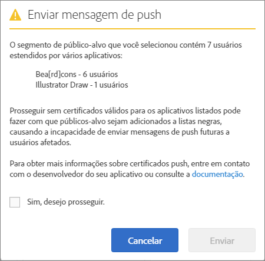

# Público: mensagens por push {#audience-define-and-configure-audience-segments-for-push-messages}

É possível definir e configurar as opções de público-alvo para mensagens de push, incluindo as opções de intervalo de data, os segmentos do Analytics e os segmentos personalizados.

## Definir segmentos de público {#section_7C4D2393CF7441959FE2381A02867CAC}

Quando um segmento de público-alvo das mensagens de push é criado, o segmento pode envolver usuários de um ou mais aplicativos porque os conjuntos de relatórios ou conjuntos de relatórios virtuais podem conter dados de um ou mais aplicativos. Para obter mais informações sobre conjuntos de relatórios virtuais, consulte   [Conjuntos de relatórios virtuais](/help/using/manage-apps/c-mob-vrs.md).

No Adobe Mobile Services, os profissionais de marketing podem enviar somente para um aplicativo por plataforma. Se os profissionais de marketing tentarem encaminhar para segmentos que contêm usuários de vários aplicativos, um aviso será exibido informando que o processo pode resultar em falhas graves de envio e os usuários podem ir para a lista de bloqueios. Se você tiver uma falha de envio por push, consulte *Solução de falhas de envio por push* em   [Solucionar problemas de mensagens por push](/help/using/in-app-messaging/t-create-push-message/c-schedule-push-message.md).

Para usar os dados do Audience Manager na definição do seu segmento, consulte [Análise de público-alvo](https://docs.adobe.com/content/help/pt-BR/analytics/integration/audience-analytics/mc-audiences-aam.html).

>[!IMPORTANT]
>
>Se os usuários do aplicativo forem incluídos na lista de bloqueios, os profissionais de marketing **não** poderão voltar a enviar mensagens por push para esses usuários.

Se você selecionar um segmento de público que contenha usuários de vários aplicativos, você pode ver o seguinte alerta:

O nome do aplicativo é baseado na versão reduzida do appId, que é automaticamente enviada para o Adobe Analytics pelo SDK do Mobile Services no formato `<app name> <version number> (<bundle id>)`.

>[!TIP]
>
>O número da versão é opcional.

Até 6 conjuntos de números para a versão e 5 conjuntos de números para a ID do pacote são removidos.

Por exemplo:

* `Bea[rd]cons 1.0 (123)` aparecerá como `Bea[rd]cons`
* `Bea[rd]cons 1.2 (1.2)` aparecerá como `Bea[rd]cons`
* `Bea[rd]cons 1.2.3.4.5.6.7 (1111)` aparecerá como `Bea[rd]cons .7`
* `Bea[rd]cons 1.2.3. (1.2.3.4.5.6)` aparecerá como `Bea[rd]cons (.6)`

Para continuar a enviar a mensagem de push para os aplicativos listados, marque a caixa de seleção **[!UICONTROL Sim, eu desejo continuar.]** e clique em **[!UICONTROL Enviar]**.

## Práticas recomendadas

Algumas práticas recomendadas:

* Para reduzir a confusão, **evite** definir conjuntos de relatórios virtuais de aplicativo móvel que tenham dados de vários aplicativos.
* Use uma ID de aplicativo exclusiva como parte de um segmento de público-alvo **sempre** que desejar enviar uma mensagem de push.
Isso garante que as notificações por push sejam enviadas para um segmento de público-alvo que pertence a **apenas** um aplicativo.

### Exemplos

Estes são alguns exemplos para ajudar você a entender como definir segmentos corretamente:

**Permitido**: o profissional de marketing fornecer certificados de push para as versões para iOS e Android de um aplicativo, por exemplo, para o Adobe Photoshop. O profissional de marketing pode enviar uma notificação por push para um segmento de usuário que se estende por ambas as plataformas.

**Não permitido**: os profissionais de marketing fornecerem certificados de push para versões iOS e Android de um aplicativo, por exemplo, para o Adobe Photoshop. Se o profissional de marketing criar e enviar para um segmento de *todos os usuários ativos nos últimos 30 dias*, somente os usuários do aplicativo Adobe Photoshop iOS e Android receberão o push, e todos os usuários do aplicativo Adobe Illustrator iOS e Android serão incluídos na lista de bloqueios. Para obter mais detalhes, consulte *Solução de falhas de mensagem por push* em   [Solucionar problemas de mensagens por push](/help/using/in-app-messaging/t-create-push-message/c-troubleshooting-push-messaging.md).

## Configurar segmentos de público {#section_A92C60885A30421B8150820EC1CCBF13}

1. Acesse a página Público para criar uma nova mensagem por push.

   Para obter mais informações, consulte [Criar uma mensagem por push](/help/using/in-app-messaging/t-create-push-message/t-create-push-message.md).

   Ao configurar as opções de público, lembre-se das seguintes informações **importantes**:

   * O **[!UICONTROL Público-alvo estimado de aceitação]** é o número de dispositivos que combinam o segmento do Adobe Analytics **e** o número de dispositivos de aceitação.

      Você pode visualizar uma estimativa do número de usuários em seus segmentos selecionados que optaram por receber mensagens e receberão a mensagem de push. O número total de usuários do aplicativo é exibido abaixo da estimativa, independentemente do status de aceitação.

   * O **[!UICONTROL Total]** é o número de dispositivos que correspondem ao segmento do Adobe Analytics.

   * As mensagens por push são enviadas para os dispositivos que fazem parte de um segmento definido do Adobe Analytics **e** que aceitaram receber mensagens por push.

      Isso significa que o SDK enviou um valor `True` para a eVar de aceitação de mensagens de push.

   * Mesmo que o dispositivo tenha um token de dispositivo válido, a mensagem não será enviada ao dispositivo se o sinalizador de aceitação não constar no Adobe Analytics.

   * Para obter mais informações sobre como solucionar problemas de mensagens de push, consulte o seguinte:

      * [Mensagens por push no iOS](https://docs.adobe.com/content/help/pt-BR/mobile-services/ios/messaging-ios/push-messaging/push-messaging.html)

      * [Mensagens por push no Android](https://docs.adobe.com/content/help/pt-BR/mobile-services/android/messaging-android/push-messaging/push-messaging.html)

1. Digite informações nos seguintes campos:

   * **[!UICONTROL Durante os]**

      Especifique o período de tempo que será usado para o público-alvo estimado. Na lista suspensa **[!UICONTROL Durante os]**, selecione uma opção:

   * **[!UICONTROL Últimos]** permite selecionar um período relativo (por exemplo, os últimos 7 dias, os últimos 30 dias ou os últimos 60 dias) a partir do momento em que a mensagem é agendada para envio.

      Por exemplo, se você selecionar os últimos 30 dias e agendar a mensagem de push para 31 de outubro, o público-alvo estimado será o número de usuários que aceitaram receber as mensagens de push nos 30 dias anteriores a 31 de outubro.

   * **[!UICONTROL Intervalo estático]** permite selecionar um intervalo estático ao escolher as datas de início e de término para o intervalo do público-alvo estimado.

      Usando o exemplo anterior, se você selecionar um intervalo de datas que começa em 1° de outubro e termina em 15 de outubro, mas agendar a mensagem de push para 31 de outubro, o público-alvo estimado será o número de usuários que aceitaram receber mensagens de push no intervalo de datas estático que você especificou (1° de outubro a 15 de outubro).

   * **[!UICONTROL Segmentos do Analytics]**

      Selecione um segmento existente do Adobe Analytics na lista suspensa. Para obter mais informações consulte [Criação de segmentos](https://docs.adobe.com/content/help/pt-BR/analytics/components/segmentation/segmentation-workflow/seg-build.html).

   * **[!UICONTROL Segmentos personalizados]**

      Selecione uma métrica ou variável na lista suspensa (por exemplo, **[!UICONTROL Dias desde a última utilização]** ou **[!UICONTROL Ponto de interesse]**) e configure o filtro conforme desejado. Por exemplo, o segmento personalizado a seguir aponta os usuários que possuem um telefone celular com o iOS e estão na região da Califórnia (Estados Unidos).
   >[!IMPORTANT]
   >
   >Na seção **[!UICONTROL Criar público]**, se clicar em **[!UICONTROL And]**, uma caixa de diálogo será exibida para lembrar que cada aplicativo listado **deve** ter um certificado válido. Se clicar em **[!UICONTROL Or]**, a caixa de diálogo padrão é exibida. Para obter mais informações sobre certificados válidos e conjuntos de relatórios, consulte [Conjuntos de relatórios virtuais](/help/using/manage-apps/c-mob-vrs.md).
