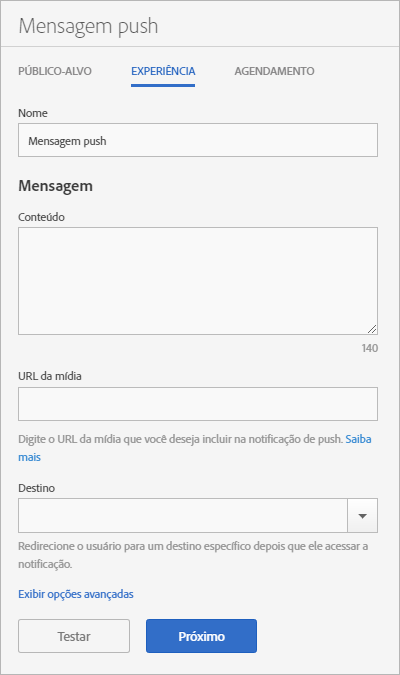

# Experience: push message {#experience-push-message}

É possível configurar opções de experiência para mensagens de push e mensagens de push avançadas, incluindo as opções de nome, texto da mensagem e destino. Também é possível configurar opções avançadas, incluindo opções de carga e personalizadas para os dispositivos iOS.

1. On the Audience page for a new push message, click Experience.****

   

1. Digite um nome para esta mensagem.
1. Digite as informações nos seguintes campos na seção **[!UICONTROL Mensagem]:**

   * **[!UICONTROL Conteúdo]**

      Especifique o texto da sua mensagem. É possível especificar até 140 caracteres.

   * **[!UICONTROL URL de mídia]**

      Digite o URL do arquivo de mídia que você planeja usar na mensagem de notificação por push. Para obter os requisitos para usar notificações por push avançadas, consulte *Requisitos para notificações* por push avançadas abaixo.

      >[!IMPORTANT]
      >
      >Para exibir uma imagem ou um vídeo em uma notificação por push, lembre-se do seguinte:
      > * Os dados `attachment-url` são tratados na carga do push.
      > * O URL da mídia deve ser capaz de lidar com picos de solicitações.

   * **[!UICONTROL Destino]**

      Selecione um destino específico (como um link da Web, deep link ou link híbrido) para enviar os usuários quando eles clicarem na mensagem. For more information, see Destinations.

      >[!TIP]
      >
      >When you use the * **[!UICONTROL Web Link]** or **[!UICONTROL Custom Link]** destination types, the destination type is not tracked. Somente os **[!UICONTROL deep links]são rastreados.**

## Requirements for rich push notifications

Estes são os requisitos para enviar notificações por push avançadas:

* **Versões suportadas**

   As notificações por push avançadas são suportadas nas seguintes versões:
   * Android 4.1.0 ou posterior
   * iOS 10 ou posterior

      >[!IMPORTANT]
      >
      >Lembre-se das seguintes informações:
      >* As mensagens de push avançadas enviadas para versões anteriores ainda serão enviadas, mas somente o texto será exibido.
      >* Ainda não há suporte para Flash no momento.

* **Formatos de arquivo**

   Estes são os formatos de arquivo suportados:
   * Imagens: JPG e PNG
   * Animações (apenas iOS): GIF
   * Vídeos (somente iOS): MP4

* **Formatos de URL**
   * Somente HTTPS

* **Dimensionamento**
   * Images must be in a 2:1 format, or they will be cropped.

Para obter mais informações sobre como configurar notificações por push avançadas, consulte o seguinte conteúdo:

* [Receber notificações por push no Android](/help/android/messaging-main/push-messaging/c-set-up-rich-push-notif-android.md)
* [Receive Rich Push Notifications in iOS](/help/ios/messaging-main/push-messaging/c-set-up-rich-push-notif-ios.md)

Para configurar uma mensagem de push na página Experiência:

1. (**Optional**) Click the **[!UICONTROL Show Advanced Options]** link to configure additional options:

   * **[!UICONTROL Carga: dados]**

      Forneça uma carga de push personalizada no JSON que será enviada para o aplicativo por meio de uma notificação por push ou local. O limite para Android e iOS é 4 KB.

   * **[!UICONTROL Opções da Apple: categoria]**

      Forneça uma categoria para as notificações locais e por push. Para obter mais informações, consulte [Gerenciamento do suporte a notificações do seu aplicativo](https://developer.apple.com/library/content/documentation/NetworkingInternet/Conceptual/RemoteNotificationsPG/SupportingNotificationsinYourApp.html#//apple_ref/doc/uid/TP40008194-CH4-SW9) na *Biblioteca de desenvolvedores do iOS*.

   * **[!UICONTROL Opções da Apple: som]**

      Forneça o nome do arquivo de som, localizado em seu pacote de aplicativos, que deseja reproduzir. Se não estiver definido, um som de alerta padrão é reproduzido. Para obter mais informações, consulte [Gerenciamento do suporte a notificações do seu aplicativo](https://developer.apple.com/library/content/documentation/NetworkingInternet/Conceptual/RemoteNotificationsPG/SupportingNotificationsinYourApp.html#//apple_ref/doc/uid/TP40008194-CH4-SW10) na *Biblioteca de desenvolvedores do iOS*.

   * **[!UICONTROL Opções da Apple: conteúdo disponível]**

      Selecione esta opção para que, quando a mensagem chegar, o iOS ative o seu aplicativo em segundo plano e permita que ele execute o código com base na carga da mensagem. For more information, see [Apple Push Notification Service](https://developer.apple.com/library/content/documentation/NetworkingInternet/Conceptual/RemoteNotificationsPG/APNSOverview.html#//apple_ref/doc/uid/TP40008194-CH8-SW1) in the *iOS Developer Library*.

1. (Opcional) Visualize o layout de sua mensagem clicando nos ícones a seguir:

   * **[!UICONTROL x Summary}**

      Oculta o painel de visualização. Clique em  para exibir o painel de visualização novamente.

   * **[!UICONTROL Change the orientation]**

      To change the orientation of the preview from portrait to landscape mode, click . Nos relógios, a orientação muda o mostrador do relógio de redondo para quadrado.

   * **[!UICONTROL Visualizar no relógio de um usuário]**

      Para visualizar sua mensagem como ela aparecerá nos relógios de um usuário, clique no ícone observação.

   * **[!UICONTROL Visualizar no celular de um usuário]**

      Para visualizar sua mensagem como ela aparecerá nos celulares dos usuários, clique no ícone de telefone.

   * **[!UICONTROL Visualizar no tablet de um usuário]**

      Para visualizar sua mensagem no tablet de um usuário, clique no ícone tablet.
   Na parte inferior do painel de visualização, você pode ver uma descrição do público-alvo selecionado na etapa anterior.

1. (**Optional**) Click **[!UICONTROL Test]** to push your message to specified devices for testing purposes.
1. Selecione o serviço e digite os tokens de push para, pelo menos, um dispositivo ao qual você deseja enviar a mensagem.

   Especifique os tokens em uma lista separada por vírgulas para encaminhar a mensagem para mais de um dispositivo.

1. Configurar as opções de agendamento da mensagem.

   Para obter mais informações, consulte [Agendamento: mensagem](/help/using/in-app-messaging/t-create-push-message/c-schedule-push-message.md)de push.
