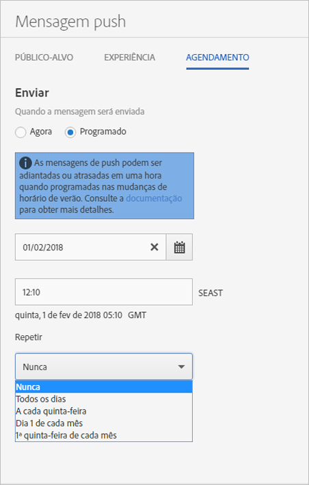

# Agendamento: mensagens de push{#schedule-push-message}

Na interface do usuário do Adobe Mobile Services, é possível agendar uma mensagem de push para ser entregue imediatamente, mais tarde e como um evento recorrente. Esses eventos podem ser agendados diária, semanal ou mensalmente.

>[!TIP]
>
>Os usuários podem modificar as configurações de agendamento para uma tarefa de mensagem de push a qualquer momento. Se não houver uma data aplicável para enviar uma mensagem recorrente agendada, por exemplo, uma tarefa mensal recorrente no 31º dia, no dia 31 de fevereiro ou na 5ª terça-feira do mês, nenhuma mensagem será enviada.

Lembre-se das seguintes informações:

* O formato de data e hora correto é `hh:mm` e `mm/dd/yyyy`.

* Você pode editar uma mensagem agendada das seguintes maneiras:

   * Altere a data para uma data posterior.
   * Altere o intervalo de repetição.

      Por exemplo, para uma mensagem que é enviada todos os dias, você pode alternar a recorrência para semanalmente.

## Antes de programar mensagens de push recorrentes

Você **deve** compreender as seguintes informações antes de agendar mensagens de push recorrentes:

* As opções exibidas na lista suspensa **[!UICONTROL Repetir]dependem da data que você digitou ou selecionou.**

   Por exemplo, se você digitou `Saturday, October 7`, as seguintes opções são exibidas:

   * **[!UICONTROL Nunca]**
   * **[!UICONTROL Todos os dias]**
   * **[!UICONTROL Todos os sábados]**
   * **[!UICONTROL Dia 7 de cada mês]**
   * **[!UICONTROL 1º sábado de cada mês]**

* As mensagens de push são agendadas e enviadas com base no Horário de Greenwich (GMT).

   Por exemplo, se você agendou uma mensagem recorrente para ser enviada todos os sábados, ao 12h (meio-dia) **PST**, a partir de 7 de outubro, a mensagem será enviada no sábado, às 19h **GMT**.
* As mensagens são enviadas de forma diferente, conforme sua localização (EUA, Europa ou Ásia).

   Por exemplo, se você estiver em San Jose, Califórnia, e agendar uma mensagem para ser enviada em ***31 de outubro*** às 17h30 **PST**, na verdade, ela será enviada em ***1º de novembro*** às 0h30 **GMT**. Se você estiver em Tóquio e agendar uma mensagem para ser enviada em ***1º de janeiro*** às 5h30, ela será enviada em ***31 de dezembro*** às 20h30 **GMT**.
* As mensagens de push são enviadas uma hora antes ou depois, dependendo de quando ocorre o horário de verão.
* Quando você visualiza o relatório de mensagens de push, a mensagem é exibida no fuso horário local do seu sistema.

   Por exemplo, se a hora de início for 12h **PST**, embora a mensagem seja enviada às 19h **GMT**, o relatório da mensagem exibirá a hora de envio como 12h **PST**.

## Schedule a recurring push message {#section_675BD754E5A04423A1751193698A978F}

1. Na página Agendar para uma nova mensagem de push, selecione **[!UICONTROL Programado]** ou **[!UICONTROL Agora]**.

   For more information, see [Create a push message](/help/using/in-app-messaging/t-create-push-message/t-create-push-message.md).

   If you selected **[!UICONTROL Now]**, the message is pushed immediately. Para evitar que a mensagem seja agendada imediatamente, clique em **[!UICONTROL Salvar como rascunho]**.

   

1. If you selected **[!UICONTROL Scheduled]**, click the calendar icon and select or type a start date.
1. Digite uma hora. 
1. Under **[!UICONTROL Repeat]**, select one of the following options:

   * **[!UICONTROL Nunca]**
   * **[!UICONTROL Todos os dias]**
   * **[!UICONTROL Todas as terças-feiras]**
   * **`<Day x>`do mês**

      As opções exibidas mudam de acordo com o dia selecionado ou digitado como o dia de início.
   * **`<nth day>`de cada mês**

      O valor exibido muda de acordo com a data que você selecionou ou digitou como a data de início.

1. In **[!UICONTROL End Repeat]**, type an end date and time.
1. Clique em uma das seguintes opções:

   * **[!UICONTROL Salvar como rascunho]**

      Esta opção salva a mensagem no formato de rascunho. Você pode escolher essa opção para salvar uma mensagem não finalizada ou para salvar a mensagem de modo que uma pessoa edite-a e aprove-a antes de ativá-la.

      If you selected **[!UICONTROL Now]** in the previous step, the draft message is sent immediately on activation. Se você selecionou uma data e hora para encaminhar a mensagem, a mensagem é enviada de acordo com essa programação.

   * **[!UICONTROL Salvar e agendar]**

      Esta opção envia a mensagem no dia e na hora agendados.

Para enviar a mensagem de rascunho mais tarde, siga um destes procedimentos:

* Click **[!UICONTROL Manage Messages]**, select the check box next to the message, and click **[!UICONTROL Activate Selected]**.
* Clique em **[!UICONTROL Salvar e enviar]para salvar a mensagem e enviá-la.**
