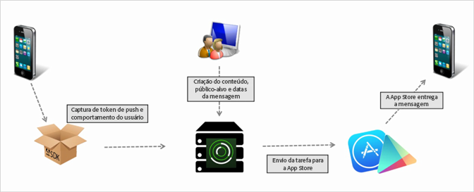

# Criar mensagem de push {#create-a-push-message}

Enviar mensagens de push para segmentos do Analytics por meio da interface do usuário do Mobile Services, utilizar os dados avançados do Analytics e garantir a participação dos usuários.

>[!IMPORTANT]
>
>Antes de criar uma mensagem por push, consulte [Pré-requisitos para ativar as mensagens por push](/help/using/c-manage-app-settings/c-mob-confg-app/configure-push-messaging/prerequisites-push-messaging.md).

As mensagens de push são exibidas para os usuários que opt in receber notificações quando não estiverem usando ativamente seu aplicativo. Essas notificações alertam os usuários sobre novas atualizações, ofertas e lembretes. Com essas notificações, é possível criar, testar, gerenciar e gerar relatórios sobre as mensagens por push em um fluxo de trabalho simplificado.

As mensagens de push são enviadas pelo lado do servidor pelas app stores, em vez do Adobe Mobile Services:

Para criar uma mensagem de push:

1. Click ***your_app_name*** > **[!UICONTROL Messaging]** > **[!UICONTROL Manage Messages]** > **[!UICONTROL Create Message]** > **[!UICONTROL Create Push]**.
1. Configurar as opções de público.

   Para obter mais informações, consulte [Público: definir e configurar segmentos de público para mensagens por push](/help/using/in-app-messaging/t-create-push-message/c-audience-push-message.md).
