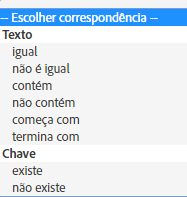

# Público: mensagem no aplicativo {#audience-in-app-message}

Você pode configurar as opções de público-alvo para mensagens no aplicativo, incluindo as opções de exibição, acionador e característica.

1. No seu aplicativo, clique em **[!UICONTROL Mensagens]** > **[!UICONTROL Gerenciar mensagens]** > **[!UICONTROL Criar mensagem]** > **[!UICONTROL Criar mensagem no aplicativo]**.
1. Na página Público-alvo, digite as informações nos seguintes campos:

   * **[!UICONTROL Exibir]**

      Selecione a opção que aciona uma mensagem para exibir:

      * **[!UICONTROL Sempre]**

         Esta opção significa que a mensagem é exibida sempre que o acionamento ocorre.

      * **[!UICONTROL Uma vez]**

         Esta opção significa que a mensagem é exibida somente na primeira vez que o acionamento ocorre.

      * **[!UICONTROL Até o click-through]**

         Esta opção significa que a mensagem é exibida sempre que o acionamento ocorre até o click-through. Esse acionamento aplica-se somente a mensagens de alerta e em tela cheia. A maioria das mensagens precisam ser redirecionadas ou usar um recurso da internet e não serão exibidas se estiver offline. Para mostrar a mensagem sempre, independentemente da conectividade de rede, marque a caixa de seleção **[!UICONTROL Exibir offline]**.
   * **[!UICONTROL Acionador]**

      Selecione uma opção na lista suspensa e escolha uma condição. Por exemplo, você poderia escolher **[!UICONTROL Lançado]** na lista suspensa e **[!UICONTROL Existe]** na segunda lista suspensa. Você também pode especificar dados de contexto personalizados, que precisam estar na ocorrência do acionamento para exibir a mensagem.

      >[!IMPORTANT]
      >
      >Se você selecionar vários acionadores, todos eles deverão acontecer na mesma ocorrência para que a mensagem seja exibida.

   * **[!UICONTROL Características]**
Você pode determinar quem deve ver a mensagem no aplicativo quando acionada e filtrar (segmentar) o público alvo para ocorrências que tenham dados especificados. Por exemplo, é possível definir uma regra em que Pontos de interesse contenham Denver. Esse filtro permite que você mostre a mensagem aos clientes que estão em um de seus pontos de interesse com Denver no nome, no momento do acionador.

## Informações adicionais sobre características e acionadores {#section_48C39EFB8CAA4F62B994FCC91DF588E6}

>[!IMPORTANT]
>
>Os acionadores e as características usam dados transmitidos do seu aplicativo para o Analytics. Esses valores são transmitidos como dados de contexto, variáveis mapeadas e métricas. Uma variável é um valor baseado em texto e uma métrica é um valor numérico.

Para ver o mapeamento desses pares de valores principais na interface do Mobile Services e validar o valor do seu acionador, clique em **[!UICONTROL Gerenciar configurações do aplicativo]** > **[!UICONTROL Gerenciar variáveis e métricas]** >, e serão exibidas as guias a seguir:

* **[!UICONTROL Variáveis e métricas padrão]**
* **[!UICONTROL Variáveis personalizadas]**
* **[!UICONTROL Métricas personalizadas]**

Depois de validar o mapeamento, selecione a correspondência ou operador lógico adequado para configurar o público-alvo da mensagem.

### Seleção de métricas e variáveis {#example_AB126F03BD1C4094B791E230B3DB1189}

As hipóteses a seguir ajudam você a determinar se deve selecionar uma métrica ou uma variável como seu acionamento:

### Métricas

Uma métrica é um número, e um exemplo é o número de compras.

1. Clique em **[!UICONTROL Gerenciar mensagens]** > **[!UICONTROL Criar mensagem]**.
1. Complete as etapas na seção **[!UICONTROL Acionador]** da guia **[!UICONTROL Público-alvo:]**

   1. Selecione um evento padrão como **[!UICONTROL Iniciado]** e, em seguida **[!UICONTROL existe]**.
   1. Selecione um segundo acionador que seja um ponto de dados personalizado mapeado a uma métrica.
   1. Em **[!UICONTROL Número]**, selecione uma opção de correspondência.

### Variáveis

Uma variável é uma cadeia de caracteres de texto que é um identificador exclusivo, como país e aeroporto, por exemplo.

1. Clique em **[!UICONTROL Gerenciar mensagens]** > **[!UICONTROL Criar mensagem]**.
1. Complete as etapas na seção **[!UICONTROL Acionador]** da guia **[!UICONTROL Público-alvo:]**

   1. Selecione um evento padrão como **[!UICONTROL Iniciado]** e, em seguida **[!UICONTROL existe]**.
   1. Selecione um segundo acionador que seja um ponto de dados personalizado mapeado a uma variável.
   1. Em **[!UICONTROL Texto]**, selecione uma opção de correspondência.

Para obter mais informações sobre dados de contexto, variáveis e métricas, consulte [Gerenciamento do seu aplicativo](/help/using/manage-apps/manage-apps.md).
