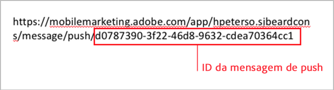
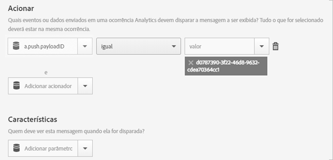

# Trigger an in-app message when the app is opened from a push message{#trigger-an-in-app-message-when-the-app-is-opened-from-a-push-message}

É possível definir o acionador de mensagem no aplicativo para ser a ID da mensagem de push que é enviada quando um usuário abre o aplicativo por meio da mensagem de push.

1. Obtenha a ID da mensagem de push que será enviada para o usuário.

   A ID da mensagem de push pode ser encontrada no URL durante o fluxo de trabalho de criação da mensagem.

   Exemplo:

   

1. Salve e ative a mensagem no aplicativo com o seguinte acionador:

   `“a.push.payloadID” =`

   >[!TIP]
   >
   >A ID da mensagem de push é a ID que você localiza na etapa 1.

   Este acionador deve ser adicionado manualmente pois não está disponível na lista suspensa **[!UICONTROL Acionador].**

   

1. Salve e envie a mensagem de push que contém a ID de push localizada na etapa 1.
1. Clique na mensagem de push para abrir o aplicativo e verificar se a mensagem no aplicativo é exibida ao abrir o aplicativo.

   Durante o teste, lembre-se das seguintes informações:

   * Depois de salvar a mensagem no aplicativo, leva cerca de 45 segundos para que o arquivo de configuração hospedado seja atualizado com a nova mensagem.
   * O aplicativo procura por atualizações feitas ao arquivo de configuração (a nova mensagem no aplicativo) quando há uma **nova** inicialização, portanto deve-se assegurar que o aplicativo esteja acionando uma nova inicialização ao clicar na mensagem de push.
   Geralmente, isso significa que você deve garantir que o tempo limite da sessão foi atingido. O tempo limite padrão é de 5 minutos.

