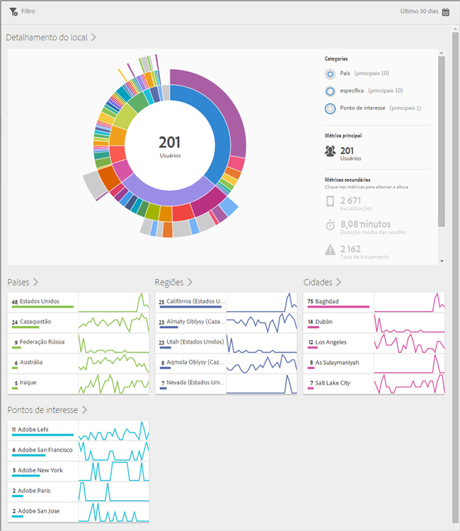
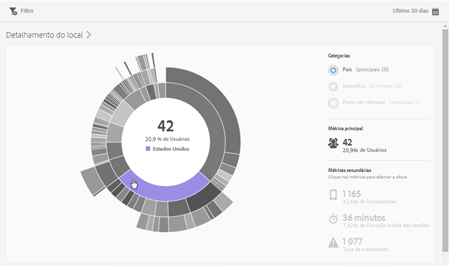
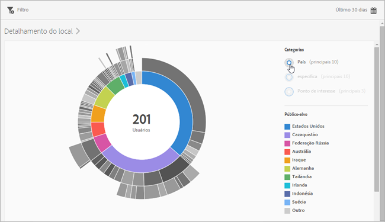
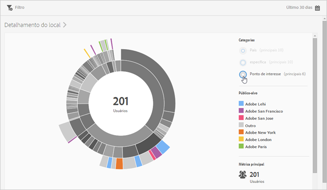
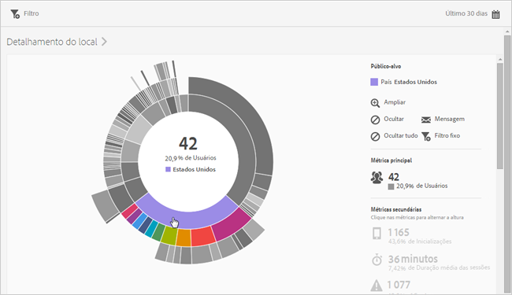
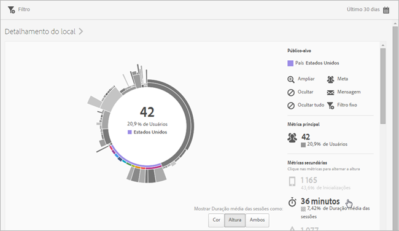
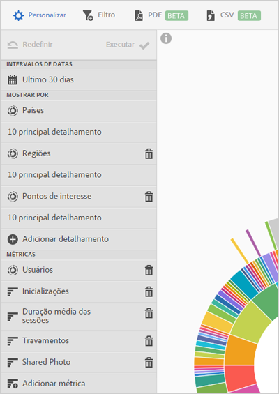

# Visão geral (localização){#overview-location}

O relatório **[!UICONTROL Visão geral de localização]** permite visualizar os diferentes países, regiões e Pontos de interesse (POIs) nos quais seu aplicativo está sendo usado.

Este relatório fornece uma visualização em forma de raio de sol dos dados existentes, e você pode usar o relatório para descobrir segmentos de público-alvo (coleções de visitantes) para segmentação. A criação e o gerenciamento de públicos-alvo é semelhante à criação e utilização de segmentos, exceto a possibilidade de disponibilizar os públicos-alvo na Experience Cloud.

Estas são algumas informações adicionais sobre este relatório:

## Navegação e utilização {#section_4A88C3849B5847BF8CF433CCFD99FDC3}

Essa visualização fornece, por exemplo, o relatório base com detalhamentos. A visualização usa a altura para mostrar a métrica em foco e as diferenças de desempenho entre as métricas. Cada anel representa um segmento de audiência na categoria do anel. É possível realizar ações em uma audiência, como aplicar um filtro fixo, ocultar uma métrica e visualizar métricas.

>[!TIP]
>
>Além dessas informações, você pode ver um tutorial no produto que descreve como interagir com o gráfico de explosão solar. Para abrir o tutorial, clique em **[!UICONTROL Detalhamento do local]** na barra de título do relatório e no ícone **[!UICONTROL i]**.

O gráfico em forma de raio de sol é interativo. Você pode alterar o período de tempo, clicando no ícone **[!UICONTROL Calendário]** no lado superior direito. Passe o mouse sobre qualquer parte do gráfico para exibir mais informações. Por exemplo, na ilustração a seguir, é possível ver o número total e a porcentagem de usuários que usam seu aplicativo nos Estados Unidos.

Nesta ilustração, os botões **[!UICONTROL Categorias]** no canto superior direito permitem alternar entre a exibição de informações sobre dez países ou regiões principais, e três **[!UICONTROL pontos de interesse]** principais.

Quando você seleciona **[!UICONTROL País]** esta é a visualização:

Quando você seleciona **[!UICONTROL Pontos de interesse]** esta é a visualização:

Você pode clicar em uma parte do anel para selecionar a audiência na qual você pode executar ações, como ampliar, ocultar audiências, criar uma mensagem no aplicativo ou um filtro fixo.

Você pode clicar em uma métrica secundária no lado direito para adicioná-la à visualização e exibi-la usando cor, altura ou ambas.

## Adicionar detalhamentos e métricas {#section_15833511E82648869E7B1EFC24EF7B82}

É possível adicionar detalhamentos e métricas secundárias, que podem alterar a altura de cada público-alvo em relação aos outros públicos no gráfico.

>[!TIP]
>
>Quanto mais anéis você adicionar ao gráfico, mais demorado será o processamento.

Para adicionar detalhamentos e métricas secundárias, clique em **[!UICONTROL Detalhamento do local]** na barra de título do relatório e em **[!UICONTROL Personalizar]** para abrir o painel direito.

Ao clicar em **[!UICONTROL Adicionar detalhamento]** ou **[!UICONTROL Adicionar métrica]**, um novo item é exibido com o mesmo nome do item anterior na respectiva lista. Clique na métrica ou detalhamento criado recentemente para acessar uma lista suspensa na qual poderá selecionar um novo item.

## Criar um filtro fixo {#section_365999D49FC744ECBF9273132497E06C}

Clique em uma parte do anel para selecionar o público-alvo para o qual deseja criar um filtro fixo e clique em **[!UICONTROL Filtro fixo]**. O filtro fixo permite que você aplique os filtros atuais e execute um novo relatório com base neles.

## Compartilhar relatórios  {#section_F8AF2AA73D4C4C008976D45847F82D0B}

Após a criação de um relatório, suas configurações são usadas para criar um URL personalizado, que pode ser copiado e compartilhado.

## Informações adicionais

Para obter mais informações sobre localização, consulte o seguinte conteúdo:

* [Mapa](/help/using/location/c-map-points.md)
* [Gerenciar pontos de interesse](/help/using/location/t-manage-points.md)