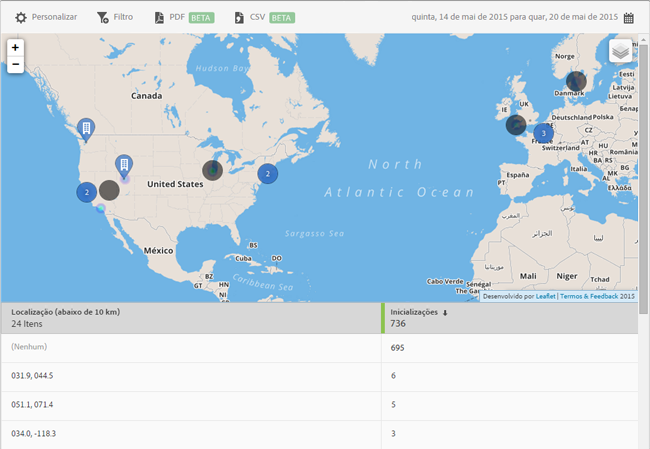

# Mapa {#map}

Você pode ver um mapa interativo que mostre seus POIs e outros marcadores de dados.

Algumas informações importantes a lembrar:

* É possível aumentar ou diminuir o tamanho do mapa.

   Esse recurso é útil, por exemplo, se você tiver dois pontos de interesse próximos. Ampliar o mapa permite que você o visualização com mais detalhes.
* Seus pontos de interesse são exibidos em azul.

   Outros marcadores de dados, como Inicializações, são exibidos em preto. Clique em um marcador para visualização de mais informações.

Clique em  para escolher as seguintes opções:

* **[!UICONTROL Mapa]**

   Exiba um mapa do site.

* **[!UICONTROL Satélite]**
Exibir o mapa no modo satélite.

* **[!UICONTROL Marcadores de dados]**

   Escolha se os marcadores de dados na cor preta devem ser exibidos.

* **[!UICONTROL Mapa de calor]**

   Escolha se deseja exibir marcadores de mapa de calor. Quanto maior a intensidade da cor, mais frequentemente a condição (Inicializações, por exemplo) é atendida.

* **[!UICONTROL Pontos de interesse]**

   Escolha se deseja exibir seus pontos de interesse.

Você pode configurar as seguintes opções no relatório:

* **[!UICONTROL Período de tempo]**

   Clique no ícone **[!UICONTROL Calendário]** e selecione um período de tempo personalizado ou escolha um período de tempo predefinido na lista suspensa.

* **[!UICONTROL Personalizar]**

   Personalize seus relatórios alterando as opções **[!UICONTROL Mostrar por]**, adicionando métricas e filtros e adicionando séries (métricas) e muito mais. Para obter mais informações, consulte [Personalizar relatórios](/help/using/usage/reports-customize/t-reports-customize.md).

* **[!UICONTROL Filtro]**

   Clique em **[!UICONTROL Filtro]** para criar um filtro que abrange vários relatórios e observar o desempenho de um segmento específico em todos os relatórios móveis. Um filtro fixo permite definir um filtro aplicado a todos os relatórios não relacionados à definição de caminho. Para obter mais informações, consulte [Adicionar um filtro fixo](/help/using/usage/reports-customize/t-sticky-filter.md).

* **[!UICONTROL Baixar]**

   Clique em **[!UICONTROL PDF]** ou **[!UICONTROL CSV]** para baixar ou abrir documentos e compartilhá-los com usuários que não têm acesso ao Mobile Services ou para usá-los em apresentações.