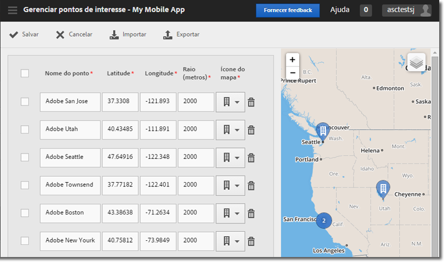

# Gerenciar pontos de interesse {#manage-points-of-interest}

É possível criar e gerenciar POIs, que permitem definir localizações geográficas que você pode usar para fins de correlação, para segmentar com mensagens no aplicativo e muito mais. Quando uma ocorrência é enviada em um POI, o POI é anexado à ocorrência.

Antes de usar a Localização, verifique os seguintes requisitos:

* Você deve ter o Analytics—Mobile Apps ou o Analytics Premium.
* Você deve ativar **[!UICONTROL Relatórios de localização]** no aplicativo.
* Se estiver usando versões anteriores à versão 4.2 do SDK do iOS ou Android, após adicionar novos **[!UICONTROL Pontos de interesse]**, você deverá baixar um novo arquivo de configuração e fornecê-lo para os desenvolvedores do seu aplicativo.

   Se estiver usando o iOS SDK ou o Android SDK versões 4.2 ou superior, não será mais necessário enviar uma atualização do aplicativo à loja para atualizar seus **[!UICONTROL Pontos de interesse]**. Na página Gerenciar pontos de interesse, ao clicar em **[!UICONTROL Salvar]**, as alterações são empacotadas para a lista **[!UICONTROL Pontos de interesse]** e o arquivo de configuração do aplicativo ativo é atualizado. Salvar também atualiza a lista de pontos do seu aplicativo nos dispositivos do usuário, desde que o aplicativo utilize o SDK e as configurações atualizadas com um URL de ponto de interesse remoto.

No dispositivo do usuário, para que uma ocorrência seja atribuída a um **[!UICONTROL Ponto de interesse]**, a localização deve estar ativada para o aplicativo.

Para usar a Localização, conclua as seguintes tarefas:

1. Clique no nome do aplicativo para ir para a página Gerenciar configurações do aplicativo.
1. Clique em **[!UICONTROL Localização]** > **[!UICONTROL Gerenciar pontos de interesse]**.

   

1. Digite as informações em cada um dos seguintes campos:

   * **[!UICONTROL Nome do ponto]**

      Digite o nome do **[!UICONTROL Ponto de localização.]**

      Pode ser o nome de uma cidade, de um país, de uma região. Você também pode criar um **[!UICONTROL Ponto de Localização]** em locais específicos, como estádios ou empresas.

   * **[!UICONTROL Latitude]**

      Especifique a latitude do **[!UICONTROL Ponto de localização]**. Você pode encontrar essas informações em outras fontes, inclusive na Internet.

   * **[!UICONTROL Longitude]**

      Especifique a longitude do **[!UICONTROL Ponto de localização]**. Você pode encontrar essas informações em outras fontes, inclusive na Internet.

   * **[!UICONTROL Raio (metros)]**

      Digite o raio (em metros) ao redor do **[!UICONTROL Ponto de localização]** que você deseja incluir. Por exemplo, se você criar um POI para Denver, Colorado, poderá especificar um raio com tamanho suficiente para incluir a cidade de Denver e as áreas subjacentes, mas excluir Colorado Springs.

   * **[!UICONTROL Ícone do mapa]**

      Selecione um ícone que será exibido nos relatórios [Visão geral](/help/using/location/c-location-overview.md) e [Mapa](/help/using/location/c-map-points.md).

1. Adicione outros POIs, se necessário.

   Recomendamos que você adicione no máximo 5.000 POIs. Se você adicionar mais de cinco mil, poderá salvá-los, mas receberá uma mensagem de aviso informando que as práticas recomendadas exigem menos de cinco mil pontos.

1. Clique em **[!UICONTROL Salvar]**.

Para excluir um ou mais POIs, marque as caixas de seleção aplicáveis e clique em **[!UICONTROL Remover seleção]**.

Clique em **[!UICONTROL Importar]** ou **[!UICONTROL Exportar]** para trabalhar com os dados, usando um arquivo `.csv` em vez da interface do Adobe Mobile.
