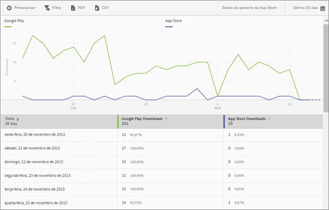

# App Store Overview report{#app-store-overview-report}

O relatório **[!UICONTROL Visão geral da App Store]oferece um instantâneo das métricas da app store, incluindo a quantidade de downloads, compras no aplicativo, avaliação média da app store, receitas geradas por downloads, receitas no aplicativo, downloads por país, downloads por app store e compras no aplicativo por nome.**

>[!TIP]
>
>In the Mobile Services UI, the **[!UICONTROL App Store]** menu item and **[!UICONTROL Overview]** report appear in the left navigation menu after you configure the integration.

O relatório **[!UICONTROL Visão geral]contém um gráfico ao longo do tempo que exibe informações sobre o número de downloads da app store, compras no aplicativo e a classificação média do aplicativo.**

Você pode clicar em qualquer métrica para ocultar ou exibir a linha correspondente. Para ver os dados de um dia, posicione o cursor sobre o dia.

>[!IMPORTANT]
>
>As métricas da App Store, como downloads, classificação, receita, classificação e assim por diante no Adobe Analytics, exigem uma integração do Conector de dados com um fornecedor adequado. `appFigures` oferece no momento uma integração, que requer a compra do produto e/ou serviço apropriado de `appFigures`**antes** que você possa habilitar a integração. Para obter mais informações sobre integrações do Data Connector, consulte [Adobe Exchange](https://www.adobeexchange.com/experiencecloud.html).

>[!TIP]
>
>Além de alterar o intervalo de datas do relatório clicando no ícone de calendário na parte superior direita, você pode personalizar alguns relatórios detalhados, adicionar filtros e séries (métricas), adicionar filtros fixos e baixar o relatório no formato PDF ou CSV. For more information, see [Customize reports](/help/using/usage/reports-customize/reports-customize.md).

## Avaliação geral da App Store {#section_60D0D21824AE4450BC3E34D7ACA12A7A}

Este relatório exibe a classificação média que os usuários deram ao seu aplicativo usando a funcionalidade da app store.

You can click anywhere on the **[!UICONTROL App Store Average Rating]** widget to display a graph and chart that displays the average rating by date. Para ver os dados de um dia, posicione o cursor sobre o dia.

## Receitas geradas por downloads {#section_34F05998E8444544A1B507C1B852C4EE}

Este relatório exibe a quantidade de receita gerada pelo download do seu aplicativo.

## Receita no aplicativo {#section_58792ED9C4B54B7D836E30CF09E8E204}

Este relatório exibe a quantidade de receita gerada pelas compras no aplicativo que foram feitas usando seu aplicativo.

## Downloads por país {#section_10373CD28CA94BA5859DFDEED7D548C6}

Este relatório exibe o número de downloads do seu aplicativo, agrupados por país.

Para exibir um gráfico com o número de downloads por país agrupados por data, clique em **[!UICONTROL Downloads por país]**. Você pode passar o mouse sobre uma data para ver os dados de um dia.

## Downloads por App Store {#section_F1CD1A3F0105469D879E4F280CE32484}

Este relatório exibe o número de downloads do seu aplicativo agrupados pela app store.

Para exibir um gráfico com o número de downloads por app store agrupados por data, clique em **[!UICONTROL Downloads por App Store]**. Você pode passar o mouse sobre uma data para ver os dados desse dia.

## Compras no aplicativo por nome {#section_D747A64F9F6449E0A02EF31D56C92F83}

Este relatório exibe todas as compras no aplicativo por nome.
