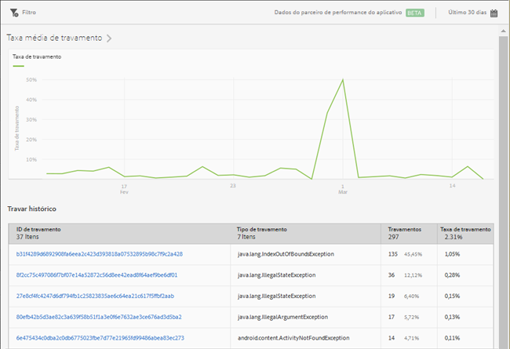

# Relatório de falhas {#crashes}

O relatório **[!UICONTROL Falhas]** oferece um resumo das falhas do aplicativo. Você pode ver o número de falhas e a taxa de falha e fazer logon na interface do usuário Apteligent.

>[!IMPORTANT]
>
>Para exibir o relatório de **[!UICONTROL Falhas]** na navegação à esquerda, primeiro é necessário integrar seu aplicativo com o Apteligent.

O gráfico de **[!UICONTROL Taxa média de falha]** exibe a taxa de falha por data. Você pode passar o mouse sobre qualquer data para ver a taxa de falha desse dia.

O gráfico **[!UICONTROL Histórico de falhas]** exibe informações sobre cada falha do aplicativo, incluindo a ID, o tipo, a quantidade e a data. Para fazer logon no Apteligent e ver mais detalhes sobre uma falha, clique no link na coluna **[!UICONTROL ID da falha]**.

Você pode configurar as seguintes opções no relatório:

* **[!UICONTROL Período]**

   Clique no ícone **[!UICONTROL Calendário]** e selecione um período personalizado ou escolha um período predefinido na lista suspensa.

* **[!UICONTROL Filtro]**

   Clique em **[!UICONTROL Filtro]** para criar um filtro que abrange vários relatórios e observar o desempenho de um segmento específico em todos os relatórios móveis. Um filtro fixo permite definir um filtro aplicado a todos os relatórios não relacionados à definição de caminho.

   Para obter mais informações, consulte [Adicionar um filtro fixo](/help/using/usage/reports-customize/t-sticky-filter.md).