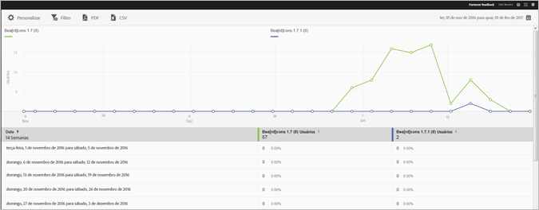

# Relatório de versões {#versions}

O relatório Versões é um relatório ao longo do tempo que mostra informações sobre as diferentes versões do aplicativo em execução no dispositivo de um usuário.

Este é um exemplo desse relatório:

