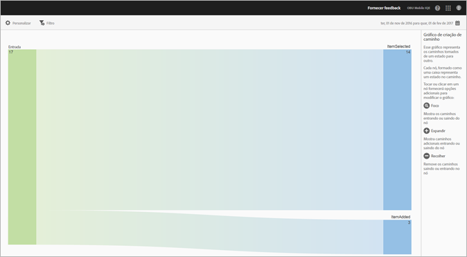
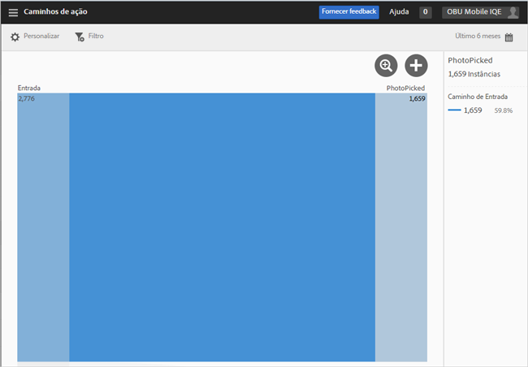
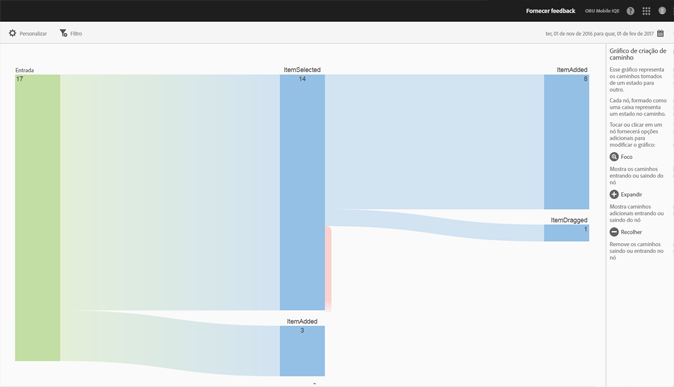
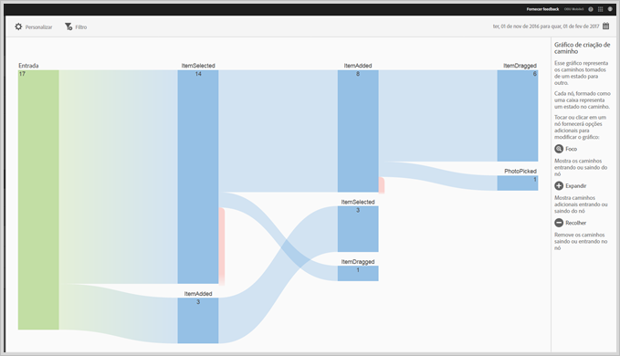
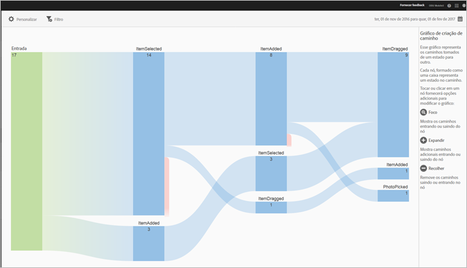

# Relatório dos Caminhos de ação{#action-paths}

O relatório Caminhos de ação se baseia na análise de caminhos e mostra um gráfico que representa os caminhos que foram tomados de um estado para outro no aplicativo.

Ambos os relatórios **[!UICONTROL Caminhos de exibição]** e **[!UICONTROL Caminhos de ação]** são relatórios de definição de caminho. O relatório **[!UICONTROL Caminhos de exibição]** mostra como os usuários navegam no seu aplicativo de uma tela para outra. O relatório **[!UICONTROL Ações de exibição]** mostra a sequência de ações e eventos, como cliques, seleções, redimensionamento, etc., que os usuários executam no aplicativo.

>[!TIP]
>
>Você pode usar um relatório de funil para combinar navegação e ações em um relatório. Para obter mais informações, consulte [Funil](/help/using/usage/reports-funnel.md).

Cada nó, formado como uma caixa, representa um estado nos caminhos dos usuários em um aplicativo. Por exemplo, no gráfico acima, o nó superior representa o número de usuários que inicializaram o aplicativo e escolheram uma foto da galeria.

Para exibir as opções para modificar o gráfico, clique em um nó e em **[!UICONTROL Focar]** ou **[!UICONTROL Expandir]**. Por exemplo, se você clicar no estado **[!UICONTROL PhotoPicked]** no nó superior, os ícones **[!UICONTROL Focar]** e **[!UICONTROL Expandir]** serão exibidos.

To expand, click the **[!UICONTROL +]** icon. Essa opção exibe os caminhos adicionais que entram ou saem do nó. No gráfico abaixo, o estado 1 está inicializando o aplicativo, o estado 2 está escolhendo uma foto (o item que você expandiu anteriormente) e o estado 3 inclui os diferentes caminhos que os usuários tomaram:

* Selecionar um item
* Adicionar um item
* Arrastar um item
* Dimensionamento de um item

Expandir um estado é semelhante a um funil.

Para isolar o nó e mostrar os caminhos que entram e saem do nó selecionado, clique no ícone . No gráfico abaixo, os seguintes caminhos foram concluídos **antes** que os usuários selecionassem uma foto:

* Girar um item
* Dimensionamento de um item
* Arrastar um item
* Remoção de um item

Dos usuários que selecionaram uma foto, os seguintes caminhos foram concluídos **após** a seleção da foto:

* Selecionar um item
* Adicionar um item
* Arrastar um item
* Dimensionamento de um item

Você pode focar ou expandir vários nós para obter uma visualização detalhada dos caminhos que os usuários tomam no aplicativo. Por exemplo:

Você pode configurar as seguintes opções no relatório:

* **[!UICONTROL Período de tempo]**

   Clique no ícone **[!UICONTROL Calendário]** e selecione um período de tempo personalizado ou escolha um período de tempo predefinido na lista suspensa.

* **[!UICONTROL Personalizar]**

   Personalize seus relatórios alterando as opções **[!UICONTROL Mostrar por]**, adicionando métricas e filtros e adicionando séries (métricas) e muito mais. Para obter mais informações, consulte [Personalizar relatórios](/help/using/usage/reports-customize/reports-customize.md).

* **[!UICONTROL Filtro]**

   Clique em **[!UICONTROL Filtro]** para criar um filtro que abrange vários relatórios e observar o desempenho de um segmento específico em todos os relatórios móveis. Um filtro fixo permite definir um filtro aplicado a todos os relatórios não relacionados à definição de caminho. Para obter mais informações, consulte [Adicionar um filtro fixo](/help/using/usage/reports-customize/t-sticky-filter.md).

* **[!UICONTROL Baixar]**

   Clique em **[!UICONTROL PDF]** ou **[!UICONTROL CSV]** para baixar ou abrir documentos e compartilhá-los com usuários que não têm acesso ao Mobile Services ou para usá-los em apresentações.