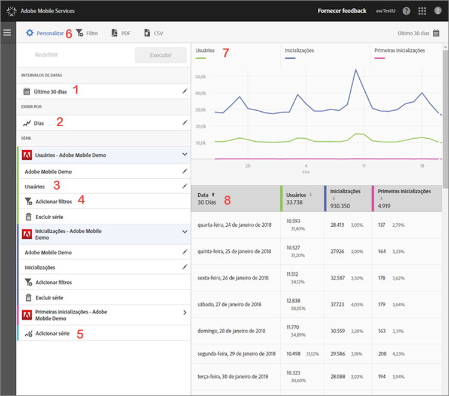

# Personalizar relatórios {#customize-reports}

Estas informações ajudam você a compreender e personalizar os relatórios incorporados.

Você pode personalizar seus relatórios alterando o intervalo de datas, as opções **[!UICONTROL Mostrar por]** (exibir os dados do gráfico e da tabela por períodos de tempo ou por dimensões), adicionar métricas e filtros, adicionar outras séries (métricas), entre outros.

Para exibir o painel Personalizar, clique no nome do aplicativo na página Visão geral e em **[!UICONTROL Personalizar]**.

O exemplo a seguir mostra o relatório Usuários e sessões com o painel **[!UICONTROL Personalizar]** aberto. Este exemplo exibe dados nos últimos 30 dias, mostrados por dia, com quatro séries ativas:

* **[!UICONTROL Usuários]**
* **[!UICONTROL Inicializações]**
* **[!UICONTROL Primeiras inicializações]**
* **[!UICONTROL Downloads da App Store]**

As informações abaixo descrevem cada área do relatório e o painel **[!UICONTROL Personalizar]**:

| Número | Descrição |
|--- |--- |
| 1 | Nos **[!UICONTROL Intervalos de datas]**, a lista suspensa permite selecionar diversos intervalos de datas para o seu relatório. Todos os dados no gráfico (9) e na tabela correspondente (10) respeitam o intervalo de datas selecionado. |
| 2 | Em **[!UICONTROL Mostrar por]**, a lista suspensa permite selecionar uma exibição baseada em tempo ou em dimensão para seu relatório.  Por exemplo, na figura anterior, é possível ver que Dias foi selecionado. Se você observar as datas abaixo do gráfico (7) e as linhas na tabela (8), os dados estão categorizados por data em um relatório ao longo do tempo. É possível relatar até seis métricas nos relatórios ao longo do tempo, adicionando séries. Se você selecionar uma dimensão Ciclo de vida, poderá visualizar os 50 valores principais em uma lista classificada, os 5 valores principais com tendência por dia ou semana ou um detalhamento dos 5 ou 10 valores principais. |
| 3 | **[!UICONTROL As Séries]** representam métricas individuais, como Usuários, Inicializações, Primeiras inicializações e Downloads da App Store no exemplo acima. Cada série é codificada por cores com os dados no gráfico (7) e na tabela (8). Você pode adicionar outras séries (métricas) e até aplicativos diferentes (em vários conjuntos de relatórios) para comparar dados. Para obter mais informações, consulte [Adicionar séries (métricas) a relatórios](/help/using/usage/reports-customize/t-reports-series.md). |
| 4 | Com **[!UICONTROL Adicionar filtro]**, é possível personalizar os relatórios internos, adicionando filtros extras (segmentos). Para obter mais informações, consulte [Adicionar filtros a relatórios](/help/using/usage/reports-customize/t-reports-customize.md). |
| 5 | Com **[!UICONTROL Adicionar séries]**, é possível personalizar os relatórios internos, adicionando séries extras (métricas) ou aplicativos em diferentes conjuntos de relatórios para comparar os dados. Para obter mais informações, consulte [Adicionar séries (métricas) a relatórios](/help/using/usage/reports-customize/t-reports-series.md). |
| 6 | Com o **[!UICONTROL Filtro fixo]**, você pode criar um filtro que abrange relatórios diferentes. Por exemplo, você pode querer ver o desempenho de um determinado segmento em todos os relatórios móveis. Um filtro fixo permite definir um filtro que é aplicado em todos os relatórios sem definição de caminho. Para obter mais informações, consulte [Adicionar filtro fixo](/help/using/usage/reports-customize/t-sticky-filter.md). |
| 7 | O **[!UICONTROL Gráfico de dados]** exibe os dados em um gráfico apropriado com base nas métricas selecionadas. Os tipos de gráfico incluem gráficos de linha, gráficos de barra, gráficos de rosca, etc. |
| 8 | A **[!UICONTROL Tabela de dados]** mostra os dados na forma de tabelas. Você pode clicar em um cabeçalho da coluna para classificar os dados em ordem crescente ou decrescente. |
