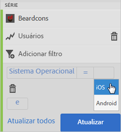
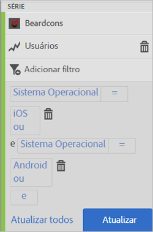
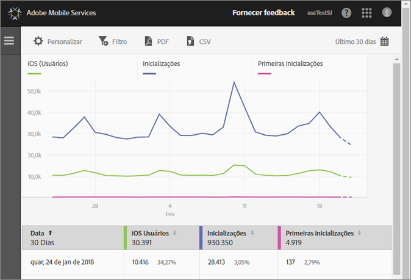
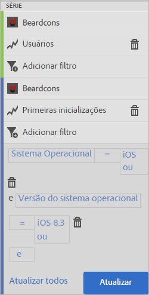
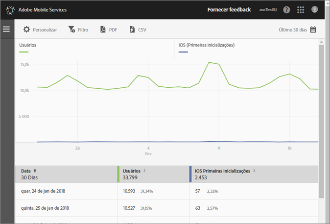

# Adicionar filtros aos relatórios{#add-filters-to-reports}

Estas informações ajudam você a personalizar os relatórios internos, adicionando filtros (segmentos).

>[!IMPORTANT]
>
>Métricas de aplicativos móveis também estão disponíveis em relatórios e análises de marketing, análise ad hoc, data warehouse e outras interfaces de relatórios do Analytics. Se um detalhamento ou tipo de relatório não estiver disponível no Adobe Mobile, poderá ser gerado usando uma interface de relatórios diferente.

Neste exemplo, vamos personalizar o relatório **[!UICONTROL Usuários e sessões]**, mas as instruções se aplicam a todos os relatórios.

1. Open your app and click **[!UICONTROL Usage]** > **[!UICONTROL Users &amp; Sessions]**.

   

   Este relatório fornece uma visualização completa de hora extra dos usuários do aplicativo. No entanto, as métricas para as versões iOS e Android deste aplicativo são coletadas no mesmo conjunto de relatórios. Podemos segmentar usuários por SO móvel adicionando um filtro personalizado à métrica Usuários.

1. Clique em **[!UICONTROL Personalizar]**.

   

1. Em **[!UICONTROL Usuários]**, clique em **[!UICONTROL Adicionar filtro]** e em **[!UICONTROL Adicionar regra]**.

1. Selecione **[!UICONTROL Sistemas operacionais]** e, na lista suspensa, selecione **[!UICONTROL IOS]**.

   

   Para adicionar o Android como filtro, é necessário repetir essa etapa.

1. Clique em **[!UICONTROL And]**, selecione **[!UICONTROL Sistemas operacionais]** na lista suspensa, e selecione **[!UICONTROL Android]**.

   Agora, seus filtros terão o mesmo visual do exemplo abaixo:

   

1. Clique **[!UICONTROL Atualizar]**.
1. Para gerar o relatório novamente, clique em **[!UICONTROL Executar]**.

   Este relatório agora mostra os usuários detalhados por sistema operacional. O título do relatório foi alterado para corresponder aos filtros aplicados ao relatório.

   

   É possível personalizar esse relatório ainda mais. No iOS 8.3, você pode adicionar a métrica de Primeiras inicializações com um filtro do sistema operacional iOS versão 8.3 para ver quantos clientes do iOS 8.3 atualizaram os aplicativos e realizaram uma primeira inicialização.
1. Em **[!UICONTROL Primeiras inicializações]**, clique em **[!UICONTROL Adicionar filtro]**, depois clique em **[!UICONTROL Adicionar regra]**, selecione **[!UICONTROL Sistemas operacionais]** na lista suspensa e selecione **[!UICONTROL iOS]**.
1. Clique em **[!UICONTROL And]**, selecione **[!UICONTROL Versões do sistema operacional]** na lista suspensa e selecione **[!UICONTROL iOS 8.3]**.

   Agora, seus filtros serão iguais ao exemplo abaixo:

   

1. Clique em **[!UICONTROL Atualizar]** e **[!UICONTROL Executar]**.

   Esse relatório agora mostra os usuários com o iOS 8.3 que inicializaram o aplicativo pela primeira vez.

   

   Teste as diferentes opções no menu de personalização do relatório e certifique-se de marcar seus favoritos. Os relatórios de URLs no Adobe Mobile são funcionais e podem ser enviados por email ou adicionados aos favoritos.
