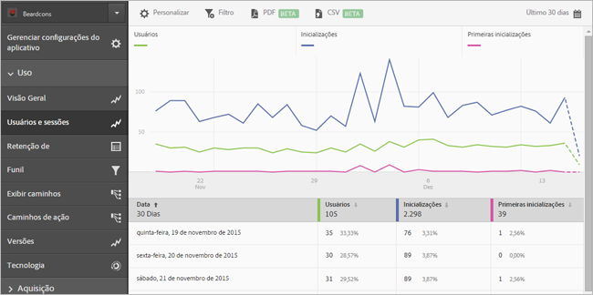
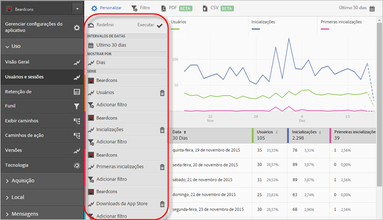
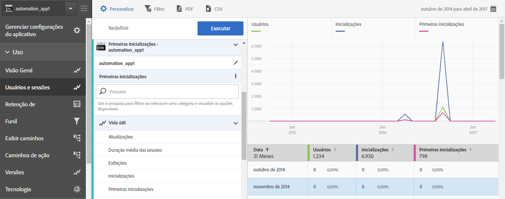
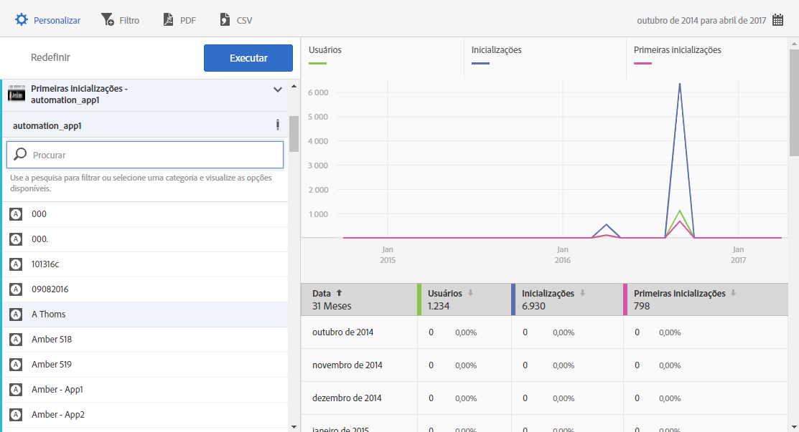

# Add series (metrics) to reports{#add-series-metrics-to-reports}

Estas informações ajudam você a personalizar os relatórios internos, adicionando séries (métricas) ou aplicativos em diferentes conjuntos de relatórios para comparar os dados.

>[!IMPORTANT]
>
>Mobile app metrics are also available in marketing reports and analytics, ad hoc analysis, data warehouse, and other Analytics reporting interfaces. Se um detalhamento ou tipo de relatório não estiver disponível no Adobe Mobile, poderá ser gerado usando uma interface de relatórios diferente.

In this example, we will customize the **[!UICONTROL Users &amp; Sessions]** report, but the instructions can apply to any report.

1. Abra o aplicativo e clique em **Utilização** &gt; **[!UICONTROL Usuários e sessões]**.

   

   Esse relatório fornece uma visualização completa dos nossos usuários do aplicativo. Contudo, queremos adicionar uma série ao relatório sobre travamentos do aplicativo.

1. Click **[!UICONTROL Customize]**.

   

1. Scroll down and click **[!UICONTROL Add Series]**.

   O nome das séries é preenchido com o mesmo nome das últimas séries da lista. Na ilustração anterior, a última série é **[!UICONTROL Downloads da App Store]**, então uma nova série será adicionada e também será intitulada **[!UICONTROL Downloads da App Store]**.

1. Conclua uma das seguintes tarefas:

   * Para adicionar uma nova série (métrica), clique no nome da série que acabou de criar e selecione uma nova métrica de Ciclo de vida na lista suspensa.

      

   * Para adicionar um novo aplicativo em um conjunto de relatórios diferente para que você possa comparar dados entre aplicativos, clique no nome do aplicativo na série recém-criada e selecione o aplicativo desejado.

      

1. (Condicional) Adicione filtros às novas séries.

   Para obter mais informações, consulte [Adicionar filtros aos relatórios](/help/using/usage/reports-customize/t-reports-customize.md).
1. Click **[!UICONTROL Update]** and **[!UICONTROL Run]**.
