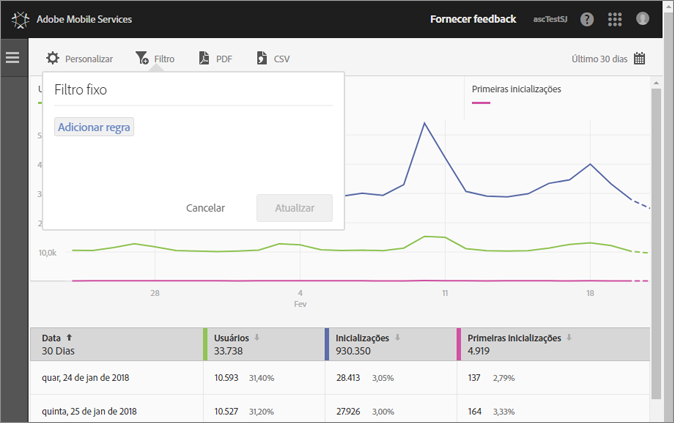
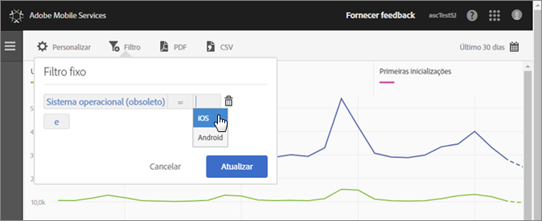
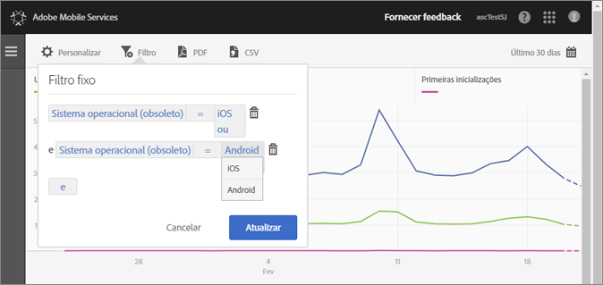

# Adicionar um filtro fixo {#add-sticky-filter}

Crie um filtro que abrange relatórios diferentes para ver o desempenho de um determinado segmento em todos os relatórios móveis. Um filtro fixo permite definir um filtro que é aplicado em todos os relatórios sem definição de caminho. 

O exemplo a seguir adiciona filtros fixos para os sistemas operacionais iOS e Android ao relatório **[!UICONTROL Usuários e sessões]**, mas as instruções se aplicam a todos os relatórios ou métricas.

1. Clique no ícone **[!UICONTROL Filtro]** na parte superior de qualquer relatório no Adobe Mobile.

   

1. Na caixa de diálogo Filtro fixo, clique em **[!UICONTROL Adicionar regra]**, selecione **[!UICONTROL Sistemas operacionais]** e, na lista suspensa, selecione **[!UICONTROL iOS]**.

   Para adicionar Android como filtro, repita esta etapa.

   

1. Clique em **[!UICONTROL E]**, selecione **[!UICONTROL Sistemas operacionais]** e, na lista suspensa, selecione **[!UICONTROL Android]**.

   Agora, seus filtros terão o mesmo visual do exemplo abaixo:

   

1. Clique em **[!UICONTROL Atualizar]** e **[!UICONTROL Executar]**.
