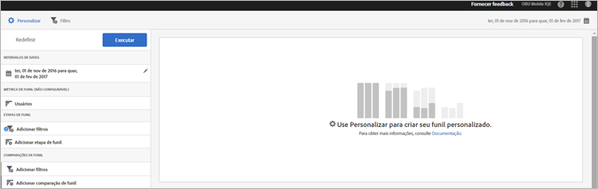
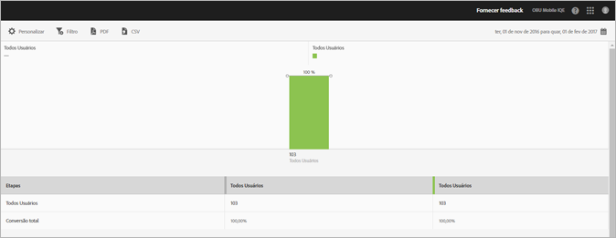

# Relatório de funil {#funnel}

O relatório de **[!UICONTROL Funil]** permite identificar onde os clientes abandonaram uma campanha de marketing ou foram desviados de um caminho de conversão definido ao interagirem com o aplicativo móvel. Você também pode usar o relatório **[!UICONTROL Funil]** para comparar as ações de segmentos diferentes.

Obter visibilidade sobre as decisões do cliente em cada etapa permite compreender onde são dissuadidos, que caminho costumam seguir e quando saem do aplicativo.

Quando você abre o relatório **[!UICONTROL Funil]**, deve criar um funil personalizado. Para obter mais informações, consulte [Personalizar relatórios](/help/using/usage/reports-customize/reports-customize.md).

>[!TIP]
>
>Para salvar seu funil personalizado, salve o URL após definir as configurações e executar o relatório. Você pode compartilhar o URL ou salvá-lo em um documento.

Este é um exemplo desse relatório:

Para demonstrar um funil simples, veja as configurações para uma configuração que usa três etapas de funil e duas comparações de funil. Presumimos que um aplicativo de demonstração permite que os usuários adicionem um item, como uma foto, e depois o compartilhe.

Na janela Personalizar, há seções para indicar que o usuário iniciou o aplicativo, adicionou uma foto de uma galeria no aplicativo, compartilhou uma ou mais fotos do aplicativo nas redes sociais, enviou uma mensagem de texto, email e assim por diante. As comparações de funil permitem comparar os níveis de adição e compartilhamento de fotos entre usuários do aplicativo iOS e do aplicativo Android.

Para gerar o relatório, clique em **[!UICONTROL Executar]**.

Exemplo de um relatório gerado:

A primeira série mostra que 100% dos usuários inicializaram o aplicativo. A segunda série mostra que uma porcentagem maior de usuários do Android adicionou uma foto da galeria. A terceira série mostra que quase metade dos usuários do iOS compartilhou a foto, mas nenhum dos usuários do Android compartilhou a foto. Isso pode indicar um problema com o aplicativo que precisa ser investigado.

Para exibir informações adicionais, passe o mouse sobre qualquer barra no gráfico.

Você pode configurar as seguintes opções no relatório:

* **[!UICONTROL Período]**

   Clique no ícone **[!UICONTROL Calendário]** e selecione um período personalizado ou escolha um período predefinido na lista suspensa.
* **[!UICONTROL Personalizar]**

   Personalize seus relatórios alterando as opções **[!UICONTROL Mostrar por]**, adicionando métricas e filtros e adicionando séries (métricas) e muito mais. Para obter mais informações, consulte [Personalizar relatórios](/help/using/usage/reports-customize/reports-customize.md).
* **[!UICONTROL Filtro]**

   Clique em **[!UICONTROL Filtro]** para criar um filtro que abrange vários relatórios e observar o desempenho de um segmento específico em todos os relatórios móveis. Um filtro fixo permite definir um filtro aplicado a todos os relatórios não relacionados à definição de caminho. Para obter mais informações, consulte [Adicionar filtro fixo](/help/using/usage/reports-customize/t-sticky-filter.md).
* **[!UICONTROL Baixar]**

   Clique em **[!UICONTROL PDF]** ou **[!UICONTROL CSV]** para baixar ou abrir documentos e compartilhá-los com usuários que não têm acesso ao Mobile Services ou para usá-los em apresentações.