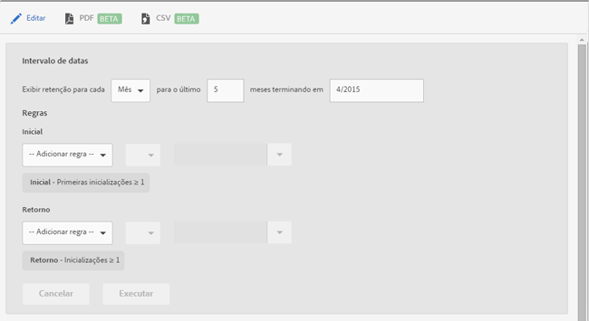

# Relatório de retenção {#retention}

{#eol}

O relatório **[!UICONTROL Retenção]** (antigo Coorte da primeira inicialização) é um relatório de coorte que mostra quantos usuários únicos inicializaram o aplicativo pela primeira vez e, então, inicializaram-no novamente pelo menos uma vez durante os meses seguintes.

Por padrão, esse relatório mostra a retenção de grupos de usuários com base em quando os usuários inicializaram o aplicativo pela primeira vez. Você também pode personalizar este relatório para usar uma métrica diferente de Primeira inicialização e adicionar outras ações.

Um coorte é um grupo de pessoas que compartilham uma característica ou experiência em comum em um período definido. O relatório **[!UICONTROL Retenção]** reúne as características comuns dos usuários que instalaram o aplicativo em um dia, semana ou mês específico e gera um gráfico com o número de usuários que inicializarão o aplicativo nos próximos X dias, semanas ou meses. O relatório exibe se os visitantes foram mantidos como ativos ou envolvidos.

Este é um exemplo desse relatório:

Na coluna **[!UICONTROL M0]**, o número total de pessoas que inicializaram o aplicativo pela primeira vez em novembro de 2014 é exibido. Na coluna **[!UICONTROL M1]**, o número de pessoas que inicializaram o aplicativo novamente em dezembro de 2014, e assim por diante, é exibido.

Para alterar o intervalo de datas ou editar as regras do relatório, clique em **[!UICONTROL Editar]**.

O relatório pode ser preenchido por qualquer variável ou métrica, incluindo as medições de ciclo de vida, mas excluindo as métricas calculadas.
