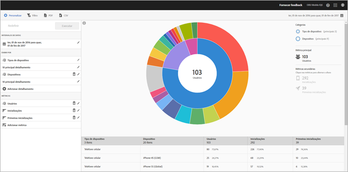

# Relatório de tecnologia {#technology}

O relatório **[!UICONTROL Tecnologia]** permite ver os diferentes tipos de dispositivos, sistemas operacionais, versões de sistemas operacionais e operadoras de celular nos quais seu aplicativo é usado.

Este relatório fornece uma visualização em forma de raio de sol dos dados existentes, e você pode usar o relatório para descobrir segmentos de público-alvo (coleções de visitantes) para segmentação. A criação e o gerenciamento de públicos-alvo é semelhante à criação e utilização de segmentos, exceto a possibilidade de disponibilizar os públicos-alvo na Experience Cloud.

## Navegação e utilização {#section_83CA60E1AE6245FEBCBFF3205615C4DF}

Essa visualização fornece, por exemplo, o relatório básico e os detalhamentos, usa a altura para mostrar a métrica em foco e as diferenças de desempenho entre as métricas. Cada anel representa um segmento de público alvo na categoria do anel. É possível realizar ações em um público alvo, como aplicar um filtro fixo, ocultar uma métrica e visualizar métricas.

>[!TIP]
>
>Além dessas informações, você pode ver um tutorial no produto que descreve como interagir com o gráfico de explosão solar. Para iniciar o tutorial, clique em **[!UICONTROL Detalhamento da tecnologia]** na barra de título do relatório, clique em **[!UICONTROL Personalizar]**, depois no ícone **[!UICONTROL i]**.

O gráfico em forma de raio de sol é interativo e você pode concluir as seguintes tarefas:

* Passe o mouse sobre qualquer parte do gráfico para exibir mais informações.
* Altere o período de tempo, clicando no ícone **[!UICONTROL Calendário]**.
* Clique em uma parte do anel para selecionar o público-alvo no qual você pode realizar ações, como ampliar, ocultar públicos-alvo, criar uma mensagem no aplicativo ou um filtro fixo.
* No canto superior direito, selecione **[!UICONTROL Tipo de dispositivo]** e **[!UICONTROL Dispositivo]** para exibir as informações sobre os dispositivos e tipos de dispositivos.

* Clique em uma métrica secundária no lado direito para adicioná-la à visualização.

   Você pode exibir a métrica secundária por cor, altura ou ambos.

A tabela abaixo descreve os relatórios padrão e como eles são preenchidos no Mobile Services:

| Relatório | Método de preenchimento | Descrição |
|--- |--- |--- |
| Dispositivo | Medições de ciclo de vida | Métricas comuns detalhadas por tipo de dispositivo. |
| Sistemas operacionais | Automático | Métricas comuns detalhadas pelo sistema operacional. |
| Versão do sistema operacional | Medições de ciclo de vida | Métricas comuns detalhadas por versão do sistema operacional. |
| Operadoras | Automático | Métricas comuns detalhadas por operadoras. |

>[!TIP]
>
>No relatório **[!UICONTROL Operadoras]**, os usuários de Wi-Fi estão registrados como `none`.

## Adição de detalhamentos e métricas {#section_15833511E82648869E7B1EFC24EF7B82}

É possível adicionar detalhamentos e métricas secundárias, que podem alterar a altura de cada público-alvo em relação aos outros públicos no gráfico.

>[!IMPORTANT]
>
>Quanto mais anéis você adicionar ao gráfico, mais demorado será o processamento.

Para adicionar detalhamentos e métricas secundárias, clique em **[!UICONTROL Detalhamento da tecnologia]** na barra de título do relatório e em **[!UICONTROL Personalizar]**.

Se você clicar em **[!UICONTROL Adicionar detalhamento]** ou **[!UICONTROL Adicionar métrica]**, um novo item será exibido com o mesmo nome do item anterior da lista. Clique na métrica ou detalhamento criado recentemente para acessar uma lista suspensa na qual poderá selecionar um novo item.

## Criação do filtro fixo {#section_B4E355CD1FE34E4C8ADC38139ED67FC8}

Clique em uma parte do anel para selecionar o público-alvo para o qual deseja criar um filtro fixo e clique em **[!UICONTROL Filtro fixo]**. Este filtro permite aplicar os filtros atuais e executar um novo relatório com base neles.

## Compartilhar relatórios   {#section_560DD5CED5144249B7E49461E2422100}

Depois de criar um relatório, suas configurações são usadas para criar um URL personalizado que você pode copiar e compartilhar.
