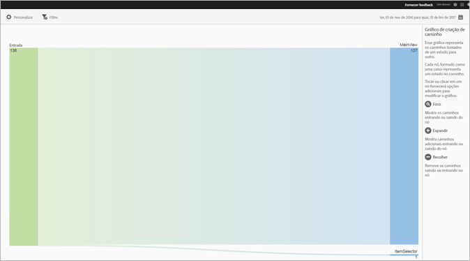
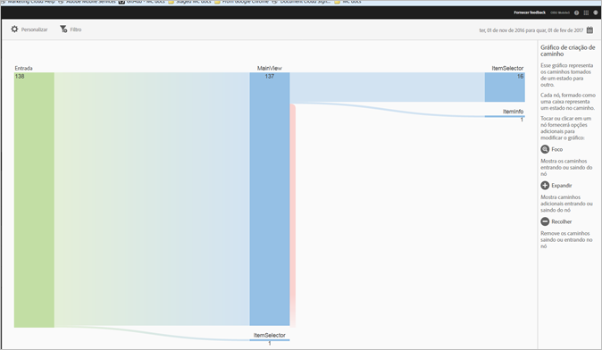
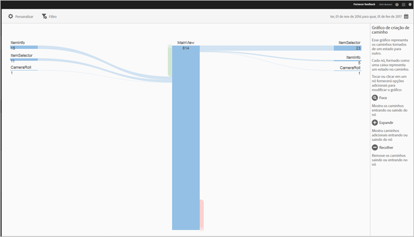
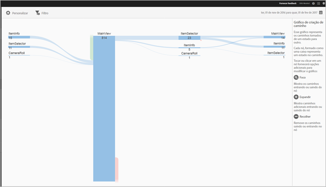

# Exibir relatório Caminhos {#view-paths}

O relatório **[!UICONTROL Caminhos de exibição]**, que se baseia na análise de caminhos, mostra um gráfico que representa os caminhos que foram tomados entre estados no aplicativo.

>[!TIP]
>
>Os relatórios **[!UICONTROL Caminhos de exibição]** e **[!UICONTROL Ação de exibição]** são semelhantes porque ambos são relatórios de definição de caminho. O relatório **[!UICONTROL Caminhos de exibição]** permite ver como os usuários navegam no seu aplicativo de uma tela para outra. O relatório **[!UICONTROL Ações de exibição]** exibe a sequência de ações (eventos, como cliques, seleções, redimensionamento, etc.) que os usuários executam no aplicativo. Você pode usar um relatório de funil para combinar navegação e ações em um relatório. Para obter mais informações, consulte [Funil](/help/using/usage/reports-funnel.md).

Cada nó, formado como uma caixa, representa um estado nos caminhos dos usuários em um aplicativo. Por exemplo, na ilustração acima, o nó superior representa o número de usuários que inicializaram o aplicativo e navegaram até a exibição principal.

Quando você clica em um nó para fornecer as opções adicionais para modificar o gráfico, opções adicionais como **[!UICONTROL Focar]** ou **[!UICONTROL Expandir]** são exibidas. Por exemplo, se você clicar no estado **[!UICONTROL MainView]** no nó superior, os ícones **[!UICONTROL Focar]** e **[!UICONTROL Expandir]** serão exibidos.

Para expandir a exibição, clique no ícone **[!UICONTROL +]** para exibir os caminhos adicionais que entram ou saem do nó. Na ilustração abaixo, o estado 1 é a inicialização do aplicativo, o estado 2 é a visualização da página principal do aplicativo e o estado 3 inclui os seguintes caminhos que os usuários tomaram:

* Navegando até o rolo da câmera
* navegando até o seletor de itens
* navegando até a câmera
* navegando para a página de informações do item

Clique em  para isolar o nó e mostrar os caminhos que entram e saem do nó selecionado. Na ilustração abaixo, os seguintes caminhos precederam os usuários que estavam vendo a exibição principal do aplicativo:

* informações do item
* seletor de item
* Rolo da câmera
* Câmera

Você pode focar ou expandir vários nós para uma exibição detalhada dos caminhos que os usuários tomaram no aplicativo. Por exemplo:

Você pode configurar as seguintes opções no relatório:

* **[!UICONTROL Período]**
Clique no ícone **[!UICONTROL Calendário]** para selecionar um período personalizado ou um período atual na lista suspensa.
* **[!UICONTROL Personalizar]**
Para personalizar seus relatórios, altere as opções **[!UICONTROL Mostrar por]**, adicionando métricas e filtros, séries (métricas) extras e muito mais. Para obter mais informações, consulte [Personalizar relatórios](/help/using/usage/reports-customize/reports-customize.md).
* **[!UICONTROL Filtro]**
Clique em **[!UICONTROL Filtro]** para criar um filtro que abrange vários relatórios e observar o desempenho de um segmento específico em todos os relatórios móveis. Um filtro fixo permite definir um filtro aplicado a todos os relatórios não relacionados à definição de caminho. Para obter mais informações, consulte [Adicionar filtro fixo](/help/using/usage/reports-customize/t-sticky-filter.md).
* **[!UICONTROL Download]**
Clique em **[!UICONTROL PDF]** ou **[!UICONTROL CSV]** para baixar ou abrir documentos e compartilhá-los com usuários que não têm acesso ao Mobile Services ou para usá-los em apresentações.