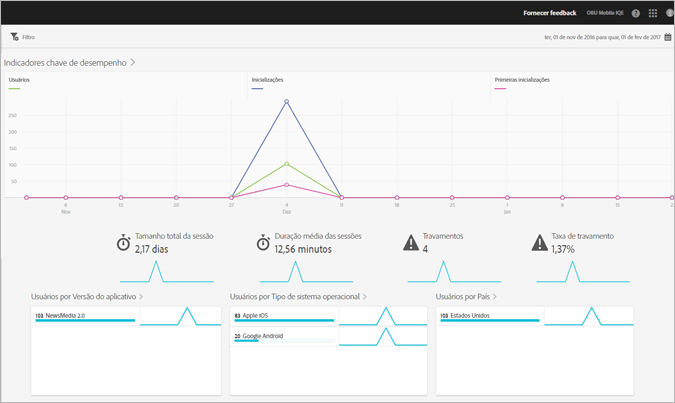

# Relatório de visão geral {#overview}

O relatório Visão geral fornece um resumo das métricas principais.

Este é um exemplo desse relatório:

Você pode alterar o intervalo de datas do relatório clicando no ícone de calendário no lado superior direito. Também é possível criar um filtro fixo que abranja vários relatórios para observar o desempenho de um segmento em todos os relatórios móveis. Para obter mais informações sobre como criar um filtro fixo, consulte [Adicionar filtro fixo](/help/using/usage/reports-customize/t-sticky-filter.md).

>[!TIP]
>
>Você configura as métricas principais para este relatório ao criar o aplicativo. Para obter mais informações, consulte [Configuração do aplicativo](/help/using/c-manage-app-settings/c-mob-confg-app/c-mob-confg-app.md).
