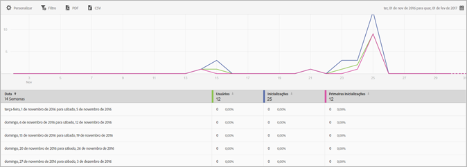

# Relatório de usuários e sessões{#users-and-sessions}

O relatório Usuários e sessões exibe as métricas de visitantes únicos para o período de tempo selecionado.

Você pode configurar as seguintes opções no relatório:

* **[!UICONTROL Período de tempo]**

   Clique no ícone **[!UICONTROL Calendário]** e selecione um período de tempo personalizado ou escolha um período de tempo predefinido na lista suspensa.

* **[!UICONTROL Personalizar]**

   Personalize seus relatórios alterando as opções **[!UICONTROL Mostrar por]**, adicionando métricas e filtros e adicionando séries (métricas) e muito mais. Para obter mais informações, consulte [Personalizar relatórios](/help/using/usage/reports-customize/t-reports-customize.md).

* **[!UICONTROL Filtro]**

   Clique em **[!UICONTROL Filtro]** para criar um filtro que abrange vários relatórios e observar o desempenho de um segmento específico em todos os relatórios móveis. Um filtro fixo permite definir um filtro aplicado a todos os relatórios não relacionados à definição de caminho. Para obter mais informações, consulte [Adicionar filtro fixo](/help/using/usage/reports-customize/t-sticky-filter.md).

* **[!UICONTROL Baixar]**

   Clique em **[!UICONTROL PDF]** ou **[!UICONTROL CSV]** para baixar ou abrir documentos e compartilhá-los com usuários que não têm acesso ao Mobile Services ou para usá-los em apresentações.