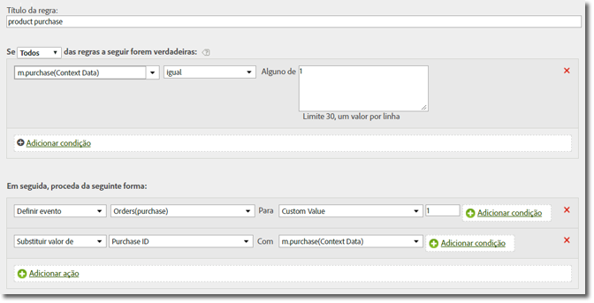

# Variável products {#products-variable}

A variável products não pode ser definida usando regras de processamento. No SDK móvel, você deve usar uma sintaxe especial dentro do parâmetro de dados de contexto para definir produtos diretamente na chamada do servidor.

To set the *`products`* variable, set a context data key to `"&&products"`, and set the value using the syntax defined for the *`products`*:

```js
cdata["&&products"] = "Category;Product;Quantity;Price[,Category;Product;Quantity;Price]";
```

Por exemplo:

```js
//create a context data dictionary 
var cdata = new Windows.Foundation.Collections.PropertySet(); 
 
// add products, a purchase id, a purchase context data key, and any other data you want to collect. 
// Note the special syntax for products 
cdata["&&products"] = ";Running Shoes;1;69.95,;Running Socks;10;29.99"; 
cdata["m.purchaseid"] = "1234567890"; 
cdata["m.purchase"] = "1"; 
 
var ADB = ADBMobile; 
// send the tracking call - use either a trackAction or TrackState call. 
// trackAction example: 
ADB.Analytics.trackAction("purchase", cdata); 
// trackState example: 
ADB.Analytics.trackState("Order Confirmation", cdata);
```

*`products`* é definida diretamente na solicitação de imagem e as outras variáveis são definidas como dados de contexto. Todas as variáveis de dados de contexto devem ser mapeadas usando as regras de processamento:



Não é necessário mapear a *`products`* variável usando as regras de processamento, pois ela é definida diretamente na solicitação de imagem pelo SDK.
