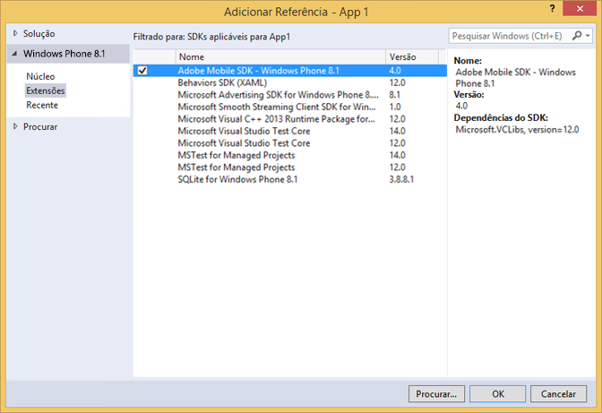

# Extensões do Windows Visual Studio para o SDK 4.x das Soluções da Experience Cloud {#windows-visual-studio-extensions-for-experience-cloud-solutions-x-sdk}

Essas extensões fornecem uma maneira muito mais fácil de adicionar a referência do Experience Cloud Solutions 4.x Windows SDK no seu projeto.

## Instalar a biblioteca do GitHub {#section_F55DB6241EF1475286C05FEAEBF996A3}

1. Baixe o SDK universal do Windows em [GitHub](https://github.com/Adobe-Marketing-Cloud/mobile-services/releases).
1. Descompacte o arquivo baixado localmente.
1. Clique duas vezes no arquivo ADBMobileWindowsStoreVSIX.vsix ou ADBMobileWindowsPhoneVSIX.vsix para abrir o instalador.

1. Selecione **[!UICONTROL Localização Global]** e instale a biblioteca.

## Adicionar referências ao seu projeto {#section_00C14FE9243D4330BE1F4BB56FCF08B1}

1. Abra o projeto do Windows 8.1 ou do Windows Phone 8.1.
1. Abra a caixa de diálogo Gerenciador de referência .

   

1. Na guia **[!UICONTROL Extensões]** do Windows 8.1 ou do Windows Phone 8.1, localize e selecione **[!UICONTROL Adobe Mobile SDK]**.
1. Clique em **[!UICONTROL OK]** para salvá-lo.

   O SDK do Adobe Mobile será adicionado ao seu projeto e, se ainda não tiver sido adicionado, o pacote **[!UICONTROL Microsoft Visual C++ Runtime]** também será adicionado.

1. No Configuration Manager, selecione um tipo de plataforma e comece a testar seu aplicativo.
